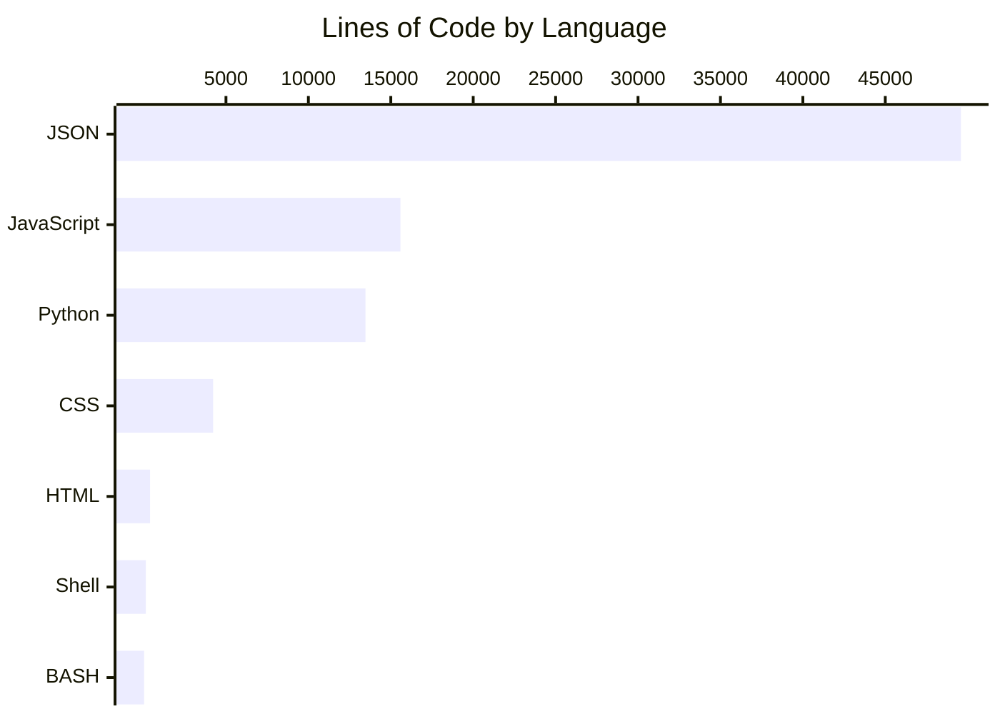

# Lines of Code Report

> **Auto-generated** by [`scripts/loc-report.sh`](scripts/loc-report.sh) — do not edit manually.

| Field | Value |
|---|---|
| **Branch** | `feat/semantic-graph-domain-tests` |
| **Commit** | `836c76e` |
| **Date** | 2026-05-19 22:34:23 -0400 |

## Language Breakdown

> [!NOTE]
> Chart renders on GitHub and in Mermaid-compatible viewers.



## Summary by Language

```
━━━━━━━━━━━━━━━━━━━━━━━━━━━━━━━━━━━━━━━━━━━━━━━━━━━━━━━━━━━━━━━━━━━━━━━━━━━━━━━━━
 Language              Files        Lines         Code     Comments       Blanks
━━━━━━━━━━━━━━━━━━━━━━━━━━━━━━━━━━━━━━━━━━━━━━━━━━━━━━━━━━━━━━━━━━━━━━━━━━━━━━━━━
 JSON                     41        49590        49589            0            1
 JavaScript               46        18023        15584          974         1465
 Python                   61        17089        13463         1312         2314
 CSS                       3         4581         4219          169          193
 Shell                     2          176          138           16           22
 BASH                      1           42           34            4            4
 Plain Text                1            9            0            9            0
─────────────────────────────────────────────────────────────────────────────────
 HTML                      3          412          395            7           10
 |- CSS                    2          124          119            5            0
 |- JavaScript             2          580          513           11           56
 (Total)                             1116         1027           23           66
─────────────────────────────────────────────────────────────────────────────────
 Markdown                 56        11276            0         8532         2744
 |- BASH                  13          169          147           14            8
 |- JavaScript             1           10            6            3            1
 |- JSON                  33         1318         1318            0            0
 |- Markdown               1            1            0            1            0
 |- Python                 3          416          385            4           27
 (Total)                            13190         1856         8554         2780
━━━━━━━━━━━━━━━━━━━━━━━━━━━━━━━━━━━━━━━━━━━━━━━━━━━━━━━━━━━━━━━━━━━━━━━━━━━━━━━━━
 Total                   214       103816        85910        11061         6845
━━━━━━━━━━━━━━━━━━━━━━━━━━━━━━━━━━━━━━━━━━━━━━━━━━━━━━━━━━━━━━━━━━━━━━━━━━━━━━━━━
```

## Frontend Assets (per file)

```
━━━━━━━━━━━━━━━━━━━━━━━━━━━━━━━━━━━━━━━━━━━━━━━━━━━━━━━━━━━━━━━━━━━━━━━━━━━━━━━━━
 Language              Files        Lines         Code     Comments       Blanks
━━━━━━━━━━━━━━━━━━━━━━━━━━━━━━━━━━━━━━━━━━━━━━━━━━━━━━━━━━━━━━━━━━━━━━━━━━━━━━━━━
 JavaScript               46        18023        15584          974         1465
─────────────────────────────────────────────────────────────────────────────────
 |bench/static/graph-view.js         2140         1661          322          157
 |nch/static/json-browser.js         1403         1361            5           37
 |panel/d3-semantic-graph.js         1454         1175          117          162
 |h/algebench/static/chat.js         1440         1174          113          153
 |lgebench/static/overlay.js         1175         1104           29           42
 |/algebench/static/proof.js         1109         1040           33           36
 |nch/static/scene-loader.js          942          801           46           95
 |algebench/static/camera.js          760          646           20           94
 |cislunar-dynamics/index.js          611          546            8           57
 |objects/animated-vector.js          533          487            3           43
 |lgebench/static/sliders.js          526          444           30           52
 |bench/static/follow-cam.js          455          417            5           33
 |graph-panel/graph-panel.js          542          410           87           45
 |nch/algebench/static/ui.js          398          342           10           46
 |atmospheric-entry/index.js          373          335            8           30
 |h/algebench/static/expr.js          356          326           20           10
 |bjects/animated-polygon.js          343          304            6           33
 |/static/objects/polygon.js          328          285           12           31
 |/objects/animated-curve.js          319          284            2           33
 |algebench/static/labels.js          327          279           22           26
 |ins/astrodynamics/index.js          228          198           10           20
 |h/static/objects/skybox.js          225          196            3           26
 |jects/animated-cylinder.js          147          134            1           12
 |/objects/animated-point.js          148          132            1           15
 |h/algebench/static/main.js          152          124           19            9
 |/algebench/static/trust.js          131          112            6           13
 |h/static/objects/vector.js          121          109            0           12
 |c/objects/animated-line.js          112           99            1           12
 |ects/parametric-surface.js          106           96            0           10
 |/algebench/static/state.js          122           92           17           13
 |h/static/objects/sphere.js           99           89            0           10
 |static/objects/cylinder.js           99           88            0           11
 |bjects/parametric-curve.js           92           84            0            8
 |/static/context-browser.js           89           69            5           15
 |tatic/objects/ellipsoid.js           74           66            0            8
 |ic/objects/vector-field.js           72           64            0            8
 |nch/static/objects/text.js           68           59            0            9
 |nch/static/objects/axis.js           62           56            0            6
 |algebench/static/coords.js           71           53           13            5
 |ch/static/objects/index.js           54           53            0            1
 |/static/objects/surface.js           52           48            0            4
 |ch/static/objects/plane.js           50           43            0            7
 |nch/static/objects/line.js           36           32            0            4
 |nch/static/objects/grid.js           33           30            0            3
 |/static/objects/vectors.js           23           19            0            4
 |ch/static/objects/point.js           23           18            0            5
─────────────────────────────────────────────────────────────────────────────────
 CSS                       3         4581         4219          169          193
─────────────────────────────────────────────────────────────────────────────────
 |algebench/static/style.css         4176         3853          156          167
 |anel/d3-semantic-graph.css          291          258           12           21
 |raph-panel/graph-panel.css          114          108            1            5
─────────────────────────────────────────────────────────────────────────────────
 HTML                      1          356          345            7            4
─────────────────────────────────────────────────────────────────────────────────
 |lgebench/static/index.html          356          345            7            4
─────────────────────────────────────────────────────────────────────────────────
 JSON                      3          319          319            0            0
─────────────────────────────────────────────────────────────────────────────────
 |ns/astrodynamics/docs.json          156          156            0            0
 |islunar-dynamics/docs.json          122          122            0            0
 |tmospheric-entry/docs.json           41           41            0            0
━━━━━━━━━━━━━━━━━━━━━━━━━━━━━━━━━━━━━━━━━━━━━━━━━━━━━━━━━━━━━━━━━━━━━━━━━━━━━━━━━
 Total                    53        23279        20467         1150         1662
━━━━━━━━━━━━━━━━━━━━━━━━━━━━━━━━━━━━━━━━━━━━━━━━━━━━━━━━━━━━━━━━━━━━━━━━━━━━━━━━━
```

## Backend Python (per file)

```
━━━━━━━━━━━━━━━━━━━━━━━━━━━━━━━━━━━━━━━━━━━━━━━━━━━━━━━━━━━━━━━━━━━━━━━━━━━━━━━━━
 Language              Files        Lines         Code     Comments       Blanks
━━━━━━━━━━━━━━━━━━━━━━━━━━━━━━━━━━━━━━━━━━━━━━━━━━━━━━━━━━━━━━━━━━━━━━━━━━━━━━━━━
 Python                   61        17089        13463         1312         2314
─────────────────────────────────────────────────────────────────────────────────
 |lgebench/backend/server.py         2037         1726          124          187
 |aph/test_latex_to_graph.py         1984         1570          161          253
 |_graph/sympy_translator.py         1417         1221           49          147
 |semantic_graph_enricher.py         1144          798          214          132
 |semantic_graph_enricher.py          853          676          106           71
 |cripts/graph_to_mermaid.py          871          613          174           84
 |nch/backend/agent_tools.py          610          522           35           53
 |ripts/audit_expressions.py          697          515           90           92
 |nch/scripts/render_math.py          510          469            4           37
 |cripts/validate_content.py          602          453           42          107
 |s/test_graph_to_mermaid.py          612          440           89           83
 |ntic_graph/preprocessor.py          309          281            6           22
 |raph/test_postprocessor.py          318          233           24           61
 |h/test_sympy_translator.py          333          231           22           80
 |t_autofill_proof_shapes.py          262          224            6           32
 |ripts/extract_structure.py          259          218            5           36
 |ic_graph/equation_chain.py          250          217            1           32
 |ench/scripts/lint_scene.py          236          185           14           37
 |/test_domain_arithmetic.py          253          170           21           62
 |tic_graph/postprocessor.py          200          168            9           23
 |emantic_graph/constants.py          196          156           12           28
 |h/generators/invariants.py          207          155            1           51
 |scripts/validate_schema.py          180          154            1           25
 |/scripts/assemble_scene.py          187          144            1           42
 |graph_highlight_overlay.py          178          137            2           39
 |/tests/test_render_math.py          177          124           18           35
 |graph/test_preprocessor.py          185          120           18           47
 |aph/test_equation_chain.py          177          114           15           48
 |st_dot_notation_restore.py          160          112           19           29
 |nd/model/semantic_graph.py          161          109           19           33
 |nch/backend/agents/base.py          124          105            0           19
 |ic_graph/test_constants.py          126          100            0           26
 |/generators/expressions.py          118           98            0           20
 |/scripts/latex_to_graph.py          108           89            8           11
 |ests/test_path_security.py          109           83            0           26
 |ntic_graph/test_service.py           90           68            0           22
 |ph/generators/variables.py           77           68            0            9
 |resolve_scene_path_safe.py           81           61            0           20
 |mantic_graph/test_cache.py           70           57            0           13
 |ents/test_schema_parity.py           73           55            0           18
 |t_semantic_graph_themes.py           69           51            0           18
 |ests/test_scene_schemas.py           66           50            0           16
 |/agents/test_base_agent.py           71           47            0           24
 |est_coverage_exhaustive.py           63           47            2           14
 |/semantic_graph/service.py           53           41            0           12
 |/test_preprocess_result.py           44           37            0            7
 |nd/semantic_graph/cache.py           41           29            0           12
 |/backend/model/__init__.py           31           29            0            2
 |aph/generators/__init__.py           25           23            0            2
 |semantic_graph/__init__.py           25           22            0            3
 |backend/agents/__init__.py           20           18            0            2
 |semantic_graph/conftest.py           23           18            0            5
 |graph/preprocess_result.py           16           11            0            5
 |ebench/backend/__init__.py            1            1            0            0
 |ebench/scripts/__init__.py            0            0            0            0
 |/tests/backend/__init__.py            0            0            0            0
 |backend/agents/__init__.py            0            0            0            0
 |_graph/domains/__init__.py            0            0            0            0
 |semantic_graph/__init__.py            0            0            0            0
 |/backend/model/__init__.py            0            0            0            0
 |lgebench/tests/__init__.py            0            0            0            0
━━━━━━━━━━━━━━━━━━━━━━━━━━━━━━━━━━━━━━━━━━━━━━━━━━━━━━━━━━━━━━━━━━━━━━━━━━━━━━━━━
 Total                    61        17089        13463         1312         2314
━━━━━━━━━━━━━━━━━━━━━━━━━━━━━━━━━━━━━━━━━━━━━━━━━━━━━━━━━━━━━━━━━━━━━━━━━━━━━━━━━
```

## Category Breakdown

| Category | Code Lines | % of JS+Python |
|---|---|---|
| JavaScript (frontend) | 15584 | 53% |
| Python (backend) | 13463 | 47% |
| **Total** | **29047** | **100%** |
