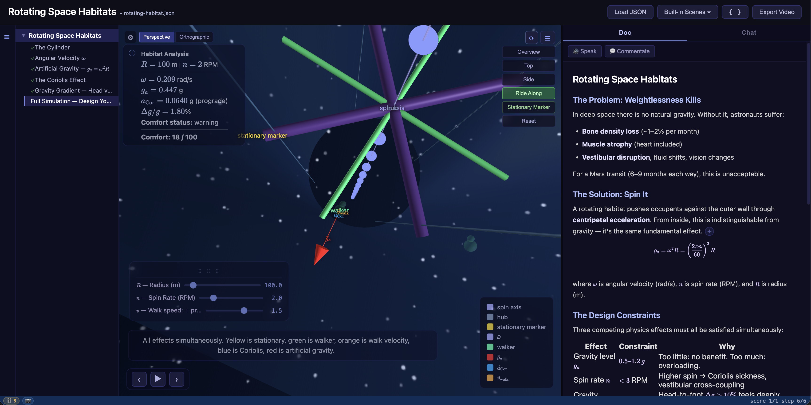

# AlgeBench

[**ibenian.github.io/algebench**](https://ibenian.github.io/algebench/)

**See and touch the math.**
**Think with an AI.**

> **AI for human understanding — not for outsourcing thought.**

Interactive 3D lessons with a live AI narrator. Spin up a scene, listen to it explain itself, then interrupt and ask *what*, *how* and the *why* — the narrator answers in real time and the visualization responds.

Step-by-step **proofs** walk through derivations alongside the 3D scene — each step shows the math, the justification, and highlighted regions you can click to see what changed. A **semantic graph** parses the current expression into an interactive flowchart of variables, operators, and relationships, so you can see the *structure* of an equation, not just its symbols. Proofs and the graph stay in sync: advance a proof step and the graph and 3D view update together.

**Made for:** self-taught learners, students, and educators who think math makes more sense when you can see it move.




---

## See it in action

**YouTube Channel:** [youtube.com/@AlgeBench](https://www.youtube.com/@AlgeBench)


| Scene                             | Video                                                        |
| --------------------------------- | ------------------------------------------------------------ |
| Measurement Reads Latitude — Bloch Sphere Intuition | [Watch](https://youtu.be/Euj3QB_F9Qs) |
| From Hilbert Space to the Bloch Sphere — Interactive Quantum Visualization | [Watch](https://youtu.be/mDEJHRxrtro) |
| Orbital Flight Simulation         | [Watch](https://youtu.be/3m1NtT3EKH4)                       |
| Pi and e — The Mathematical Duo   | [Watch](https://youtu.be/ebIaeCPCkx4)                        |
| Rotating Space Habitat Simulation | [Watch](https://www.youtube.com/watch?v=HoZgrAxKKGA)         |


**Try it yourself:** [Rotating Space Habitat](https://algebench-staging.onrender.com/?builtin=rotating-habitat)

## Deployments
|   |   |
|---|---|
| **Production** | [algebench.org](https://algebench.org) |
| **Hugging Face mirror** | [ibenian-algebench.hf.space](https://ibenian-algebench.hf.space) |
| **Staging** | [algebench-staging.onrender.com](https://algebench-staging.onrender.com) |

---


## Vision

My ultimate goal is to create an agentic system that can genuinely engage in the tangible learning process — fostering that explorative, experimental mindset, willing and courageous enough to ask daring questions freely, supported by an infinitely patient tutor that can meet you exactly where you are and take you wherever you want to go.

The motto guides every design choice:

> **AI for human understanding — not for outsourcing thought.**

The AI's job is to set the table — pick what's worth showing, build the apparatus, prepare the ground — so the learner can do the seeing, the playing, and the understanding for themselves. Computation, plotting, axis-picking, and sensible defaults are scut work the AI is happy to do. Understanding is non-transferable; only the learner can do it, and they do it by interacting with the apparatus.

**Active design proposals** (in [docs/proposals/](docs/proposals/)):
- [Parametric Analysis Visualization](docs/proposals/parametric-analysis-proposal.md) — AI-assisted, multi-dimensional response charts with sliders, animation drivers, and dimension-pickers, built on top of the semantic graph.
- [Proof Structure v2](docs/proposals/proof-structure-v2-proposal.md) — branching proofs, hypotheses, and proof techniques.
- [Lesson Builder Agents](docs/proposals/lesson-builder-agents-proposal.md) — multi-agent pipeline for authoring full lessons.
- [Citations](docs/proposals/citations-proposal.md) — academic-paper-grade source attribution.

---

## Quick Start

There are two ways to run AlgeBench locally. Either way you'll need your own Gemini API
key — see [Get a Gemini API key](#get-a-gemini-api-key).

### Option 1 — Run locally from a cloned repo

**Prerequisites:** [`uv`](https://docs.astral.sh/uv/) (recommended) **or** Python 3.10+,
plus a [Gemini API key](#get-a-gemini-api-key). With `uv` installed you don't need a
preinstalled Python — it provisions the pinned interpreter (`.python-version`, Python 3.13)
for you, on a native CPython build. This
matters on Apple Silicon: a bare `python3 -m venv` often picks an x86 Homebrew
Python and runs everything under Rosetta, which roughly halves sympy throughput.
With `uv` present the dev venv is always native arm64. If `uv` is absent the
scripts fall back to `python3 -m venv` (a warning is printed).

```bash
git clone https://github.com/ibenian/algebench
cd algebench
export GEMINI_API_KEY=your_key_here
./algebench
```

On first run, `./algebench` creates a virtual environment and installs the
dependencies automatically — no manual `pip install` needed. Then open
[http://localhost:8785](http://localhost:8785) in your browser.

To confirm the venv is native (no Rosetta) on Apple Silicon:

```bash
.venv/bin/python3 -c "import platform; print(platform.machine())"   # -> arm64
```

To launch directly into a scene:

```bash
./algebench scenes/eigenvalues.json
```

To update to the latest version of `[gemini-live-tools](https://github.com/ibenian/gemini-live-tools)` (which includes new voice characters and the voice picker UI):

```bash
./algebench --update
```

This reinstalls `gemini-live-tools` from GitHub and copies the updated `voice-character-selector.js` into the app. Not ideal, but simple enough for now.

For all available CLI options including TTS settings:

```bash
./algebench --help
```

### Option 2 — Docker image from Hugging Face

**Prerequisites:** Docker, a [Gemini API key](#get-a-gemini-api-key).

No clone, no Python setup — run the prebuilt AlgeBench image from the Hugging
Face Space registry and pass **your own** `GEMINI_API_KEY`:

```bash
docker run -it --pull=always -p 7860:7860 --platform=linux/amd64 \
	-e GEMINI_API_KEY="your_key_here" \
	registry.hf.space/ibenian-algebench:latest
```

Open [http://localhost:7860](http://localhost:7860) in your browser.

> `--pull=always` ensures you get the newest published build (Docker otherwise
> reuses a cached `:latest`). `--platform=linux/amd64` is needed on Apple Silicon
> and other ARM hosts since the Space image is built for `amd64`.

To map a different host port, change the left side of `-p` (e.g. `-p 9000:7860`)
and open that port instead.

### Get a Gemini API key

AlgeBench's AI narrator runs on Google's Gemini models, so you need your own
free API key from [Google AI Studio](https://aistudio.google.com/):

1. Go to **[aistudio.google.com](https://aistudio.google.com/)** and sign in with a Google account.
2. Open **[Get API key](https://aistudio.google.com/apikey)** (the **Get API key** button in the left sidebar).
3. Click **Create API key**. If you don't have a Google Cloud project yet, choose
   **Create API key in new project** — AI Studio creates one for you automatically.
   Otherwise pick an existing project from the list.
4. Copy the generated key. Keep it secret — treat it like a password.

> The free tier is enough to try AlgeBench. For higher rate limits, enable billing
> on the Google Cloud project backing your key.

### TTS Modes

AlgeBench supports three TTS configurations, each with different trade-offs:


| Flags                          | API                                   | Quality | Latency         | Cost                    | Best for                   |
| ------------------------------ | ------------------------------------- | ------- | --------------- | ----------------------- | -------------------------- |
| *(default)*                    | Gemini Live streaming                 | Good    | Low (~200ms)    | Single API call         | Interactive use, narration |
| `--tts-buffered`               | Gemini Live, falls back to Gemini TTS | Mixed   | Varying (2–5s+) | Multiple parallel calls | Long-form, saving to file  |
| `--tts-buffered --no-tts-live` | Gemini TTS                            | High    | Higher (3–10s+) | One call per sentence   | Highest quality output     |


**Examples:**

```bash
./algebench                                    # realtime streaming (default)
./algebench --tts-buffered                     # buffered with Live API + TTS fallback
./algebench --tts-buffered --no-tts-live       # buffered with standard Gemini TTS only
```

**Buffered mode options** (only apply with `--tts-buffered`):


| Flag                        | Default | Description                                         |
| --------------------------- | ------- | --------------------------------------------------- |
| `--tts-parallelism`         | 3       | Max concurrent sentence synthesis (1–4)             |
| `--tts-min-buffer`          | 30.0    | Seconds of audio to buffer before playback          |
| `--tts-min-sentence-chars`  | 100     | Merge short sentences up to this char count         |
| `--tts-output-file out.wav` | —       | Save audio to WAV file (auto-enables buffered mode) |


**Common options** (all modes):


| Flag                | Description                                     |
| ------------------- | ----------------------------------------------- |
| `--tts-style "..."` | Additional style guidance (e.g. "speak slowly") |


`--no-tts-live` and `--tts-output-file` automatically enable buffered mode when used without `--tts-buffered`.

---

## Contributing

See [CONTRIBUTING.md](CONTRIBUTING.md) for how to add scenes, voice characters, and more.

## Roadmap

See [docs/feature-ideas.md](docs/feature-ideas.md) for technical directions and creative ideas under consideration, and [docs/lesson-ideas.md](docs/lesson-ideas.md) for lesson concepts and content proposals.

## Documentation

- [docs/architecture.md](docs/architecture.md) — System architecture, component overview, data flow
- [docs/sandbox-model.md](docs/sandbox-model.md) — Expression evaluation, trust model, security boundary
- [docs/sandboxing-plan.md](docs/sandboxing-plan.md) — Implementation status and backend sandboxing roadmap
- [docs/feature-ideas.md](docs/feature-ideas.md) — Roadmap ideas and creative directions
- [docs/lesson-ideas.md](docs/lesson-ideas.md) — Lesson concepts across probability, ML, calculus, physics, and more
- [docs/proof-authoring.md](docs/proof-authoring.md) — Authoring proofs for the `/prove` page: vision, review process, and the two contribution paths
- [tests/proof_animation/](tests/proof_animation/README.md) — Proof-animation test suite (how to add/derive/render proofs)
- [Codebase Statistics](https://ibenian.github.io/algebench/loc-report/) — Lines of code (LOC) by language, per-file breakdowns (auto-updated)
- [Semantic Graph Report](https://ibenian.github.io/algebench/semantic-graph/) — Visual examination of the LaTeX → semantic graph pipeline (auto-deployed)
- [Proof Animation Report](https://ibenian.github.io/algebench/proof-animation/) — Interactive, morph-animated derivations from the proof test suite (auto-deployed)

---

## Project Structure

```
algebench/
├── algebench          Launcher (run this)
├── server.py          Python server
├── scenes/            Lesson JSON files (contribute here!)
│   └── ...
└── static/
    ├── main.js        Entry point — wires all modules, exposes globals
    ├── state.js       Shared mutable state
    ├── scene-loader.js  Scene/lesson loading, step navigation & undo
    ├── chat.js        AI chat panel, TTS, voice picker
    ├── proof.js       Step-by-step proof panel with LaTeX rendering
    ├── graph-view.js  Semantic graph tab (D3 expression flowcharts)
    ├── graph-panel/   Graph renderers, themes, and layout engines
    ├── proof-animation/  Realtime, Manim-style derivation morph engine (FLIP)
    ├── objects/       Element renderers
    │   ├── point.js, vector.js, polygon.js, sphere.js, …
    ├── domains/       Domain library plugins
    │   ├── astrodynamics/
    │   └── ...
    ├── index.html
    └── ...
```

---

## License

[MIT](LICENSE)

## Disclaimer

This software is provided for educational and informational purposes only. The authors and contributors make no representations or warranties regarding the accuracy, completeness, or suitability of this software for any particular purpose. Use is entirely at your own risk. The authors shall not be held liable for any direct, indirect, incidental, special, or consequential damages arising from the use of or inability to use this software. Lesson scenes, mathematical visualizations, and AI-generated explanations are all works in progress — they may contain errors or approximations and should not be relied upon as authoritative references.
