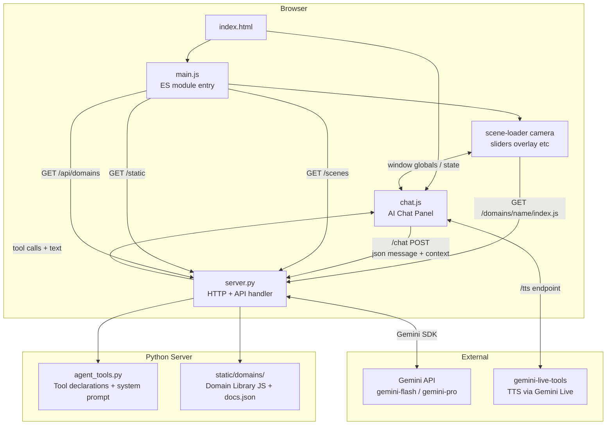

# AlgeBench — Architecture Reference

> Technical documentation for contributors and maintainers.

**Related docs:**
- [../README.md](../README.md) — Project overview and quick start
- [../CONTRIBUTING.md](../CONTRIBUTING.md) — How to contribute scenes, characters, and more
- [sandbox-model.md](sandbox-model.md) — Expression evaluation, trust model, security boundary
- [sandboxing-plan.md](sandboxing-plan.md) — Implementation status and backend sandboxing roadmap
- [latex-parser-design.md](latex-parser-design.md) — LaTeX → semantic graph builder (parser layer)
- [semantic-graph-visualization.md](semantic-graph-visualization.md) — Semantic graph → Mermaid → interactive SVG (render layer)
- [feature-ideas.md](feature-ideas.md) — Roadmap ideas and creative directions
- [lesson-ideas.md](lesson-ideas.md) — Lesson concepts and content proposals

---

## 1. Overview

AlgeBench is an interactive 3D math visualization tool with an embedded AI tutor. Users explore mathematical concepts through animated 3D scenes, interact with live sliders, and converse with a Gemini-powered agent that can navigate, explain, and dynamically build new scenes.

**Core design principles:**

- **Scene-as-data**: all visualizations are described in JSON — no visualization code written per-scene
- **Sandbox-first**: expressions are evaluated through math.js by default; native JS requires explicit user trust
- **Agent as first-class citizen**: the AI agent has the same scene-building API as human authors
- **Zero build step**: pure Python server + CDN-loaded frontend libraries; run directly from source

---

## 2. High-Level Architecture



---

## 3. Backend — `server.py`

A single-file Python HTTP server built on `http.server.BaseHTTPRequestHandler`. No web framework.

### Responsibilities

| Endpoint | Method | Purpose |
|---|---|---|
| `/` | GET | Serve `index.html` |
| `/static/*` | GET | Serve JS/CSS assets |
| `/scenes` | GET | List built-in scene JSON files |
| `/scenes/<file>` | GET | Serve a scene JSON file |
| `/chat` | POST | Forward message to Gemini, handle tool calls, return response |
| `/tts` | POST | Stream TTS audio via Gemini Live |
| `/domains/<name>/index.js` | GET | Serve a domain library script (e.g. `astrodynamics`) |
| `/api/domains` | GET | List all available domains with name, description, function names |
| `/api/domains/<name>` | GET | Return full `docs.json` for a domain (signatures, params, slider contracts, math details) |

### Chat Request Lifecycle

1. Browser POSTs `{ messages, context, history }` to `/chat`
2. Server calls `build_system_prompt(context)` (from `agent_tools.py`) to inject live scene state
3. Sends to Gemini with tool declarations
4. Gemini returns text + optional tool calls
5. Server executes tool calls (scene mutations, slider updates, memory ops)
6. Returns `{ text, toolCalls, memory }` to browser

### Agent Memory

`_agent_memory: dict` — persists across turns within a server session. The AI agent stores computed arrays, matrices, and intermediate values here via `eval_math(store_as=...)` or `mem_set(...)`. Referenced as `$key` in `add_scene` fields or as variables in subsequent `eval_math` calls.

### Key Config

| Variable | Default | Description |
|---|---|---|
| `GEMINI_API_KEY` | env | Required for AI chat |
| `GEMINI_MODEL` | `gemini-3-flash-preview` | Model for chat |
| `DEFAULT_PORT` | `8785` | HTTP listen port |

---

## 4. Agent Layer — `agent_tools.py`

Defines all Gemini tool declarations and the dynamic system prompt builder.

### Tools

| Tool | Description |
|---|---|
| `navigate_to` | Change scene/step number |
| `set_camera` | Move camera to preset view or custom position |
| `add_scene` | Build and append a new 3D scene |
| `set_sliders` | Animate sliders to target values |
| `eval_math` | Evaluate Python math expressions; supports sweeps and `store_as` |
| `mem_get` | Read a value from agent memory |
| `mem_set` | Write a value to agent memory |
| `set_preset_prompts` | Set clickable suggestion chips in the chat UI |
| `set_info_overlay` | Add/update/clear floating LaTeX overlays on the canvas |

### System Prompt

`build_system_prompt(context)` assembles the prompt fresh on every user message, injecting:

- **Current State**: scene number, step, camera position, visible elements, active sliders
- **Lesson Structure**: full scene/step tree for navigation
- **Current Scene Definition**: JSON of the current scene (steps trimmed to current position — agent cannot read ahead)
- **Current Explanation**: scene markdown
- **Agent Memory**: keys and shapes of stored values
- **Scene Instructions**: per-scene `prompt` field for specialized agent behavior
- **Instructions**: general agent behavior rules
- **Agent Tools Reference**: loaded from `agent-tools-reference.md`

---

## 5. Frontend — ES Modules

The renderer is split into focused ES modules loaded via `<script type="module" src="/main.js">`. No build step — the browser resolves the import graph directly from the Python server.

### Module Map

| Module | Responsibility |
|---|---|
| `main.js` | Entry point; wires modules, exposes `window.*` globals for `chat.js` |
| `state.js` | Single shared mutable state object |
| `camera.js` | MathBox init, arcball, projection, follow-cam loop, animation scheduler |
| `scene-loader.js` | `loadScene`, `navigateTo`, step tracker undo system |
| `overlay.js` | Explanation panel, title bar, legend, info overlays, status bar |
| `sliders.js` | Slider UI, loop animation, `runAnimUpdaters`, expression recompile |
| `context-browser.js` | Scene/step JSON tree panel |
| `json-browser.js` | Raw JSON viewer, issues panel |
| `ui.js` | Drag-drop, file picker, built-in scenes dropdown, video export |
| `follow-cam.js` | Follow-cam activation and per-frame tracking |
| `labels.js` | `renderKaTeX`, `renderMarkdown`, 3D label positioning |
| `coords.js` | Data ↔ world coordinate transforms |
| `expr.js` | Expression sandbox (math.js + JS fallback), domain loading, virtual time |
| `objects/` | One file per element type; `index.js` exports `renderElement(el, view)` |

### Key Subsystems

#### Scene Loading & Navigation

```
loadScene(json)         ← scene-loader.js
  └── importDomains()   ← expr.js
  └── buildSceneTree()  ← context-browser.js
  └── navigateTo(sceneIdx, stepIdx)
        └── renderStepAdd()   # add elements, create StepTracker
        └── processStepRemoves()  # hide elements, record in tracker
        └── buildLegend()     ← overlay.js
        └── applyStepInfoOverlays()  ← overlay.js
        └── updateStepCaption()      ← overlay.js
```

#### Step Navigation & Undo System

Each step can **add** new elements and **remove** existing ones. Both operations are reversible so the user can navigate backward freely.

**StepTracker** — one per visited step, pushed onto `state.stepTrackers`:

```js
{
  group,            // MathBox group containing this step's 3D objects
  elementIds,       // IDs of elements added by this step
  removedIds,       // IDs of elements hidden by this step's remove list
  removedSliders,   // { id: def } — slider defs hidden by this step
  sliderIds,        // IDs of sliders added by this step
  renderResults,    // animation registrations (for cleanup on destroy)
  replacedElements, // { id: oldRegistryEntry } — registry entries saved before id-reuse
}
```

**Element Registry** — `state.elementRegistry[id]` maps every named element to its current subtracker and visibility:

```js
{ tracker: subTracker, hidden: false, type: 'animated_polygon' }
```

**Forward navigation** (step N → step N+1):

1. `renderStepAdd(step.add)` renders each element into a new MathBox group, registers it in `elementRegistry`.
   — If an element id is **already registered**, the old entry is saved in `tracker.replacedElements[id]` before the registry is overwritten, and the old element is faded out.
2. `processStepRemoves(step.remove, tracker)` hides any element not in the step's own `elementIds` and records its id in `tracker.removedIds`.

**Backward navigation** (step N → step N−1):

Pops trackers from `state.stepTrackers` until length equals `targetStep + 1`. For each popped tracker:

1. **`undoStepRemoves(tracker)`** — restores elements that were hidden by this step's `remove` list, but only if no *earlier* tracker also removed the same id:
   ```
   stillRemoved = union(t.removedIds for t in stepTrackers before this one)
   for id in tracker.removedIds:
       if id not in stillRemoved: showElementById(id)
   ```

2. **`removeStepTracker(tracker)`** — destroys elements added by this step:
   - **Restore replacedElements**: for each id saved in `tracker.replacedElements`, put the old registry entry back and call `showElementById(id)` (if not still removed by a remaining tracker). This is what restores the *previous version* of an element when a step reuses an id.
   - Stops animation loops registered by this step (`renderResults`).
   - Calls `fadeOutTracker` → removes the MathBox group and disposes Three.js geometry/materials.

**Why `replacedElements` is needed:**

Without it, the sequence *add "hl" (blue) → remove "hl", add "hl" (grey) → remove "hl", add "hl_l"+"hl_r"* breaks backward navigation:

- Step 2 hides the blue "hl" via `hideElementById` (not via `removedIds`), then overwrites `elementRegistry["hl"]` with the grey entry.
- Backward from step 3 → step 2 works (tracker3.removedIds = ["hl"]; undoStepRemoves restores the grey hl).
- Backward from step 2 → step 1 fails without this fix: undoStepRemoves has nothing to do (tracker2.removedIds is empty because the id-reuse path skips it), and removeStepTracker destroys the grey hl without restoring the blue one. The original element is permanently orphaned.

With `replacedElements`, `removeStepTracker(tracker2)` finds the saved blue-hl registry entry, puts it back, and calls `showElementById("hl")` to restore the original blue highlight.

#### Element Rendering

Each element in `scene.elements` and `step.add` is dispatched by `type`:

**Static elements** — built once, zero per-frame cost:

| Type | Description |
|---|---|
| `axis` | Coordinate axis line |
| `grid` | Reference grid on xy, xz, or yz plane |
| `vector` | Static arrow from `from` to `to` |
| `vectors` | Batch of static arrows from `froms`/`tos` arrays |
| `vector_field` | Dense arrow field driven by `fx`, `fy`, `fz` expressions over a grid |
| `point` | One or more static points |
| `line` | Polyline through a list of points |
| `plane` | Finite plane defined by normal and point |
| `polygon` | Flat filled polygon from a vertex list |
| `cylinder` | Static cylinder between two endpoints |
| `sphere` | 3D sphere mesh |
| `ellipsoid` | Ellipsoid with per-axis radii (supports `centerExpr`/`radiiExpr` for slider-driven shape) |
| `surface` | Height surface `z = f(x, y)` over a 2D range |
| `parametric_curve` | Continuous curve: `x(t)`, `y(t)`, `z(t)` expressions over a range |
| `parametric_surface` | 3D surface: `x(u,v)`, `y(u,v)`, `z(u,v)` expressions |
| `text` | 3D text label at a fixed position |
| `skybox` | Background style — solid color, starfield, or gradient |

**Animated elements** — update every frame via expression evaluation:

| Type | Description |
|---|---|
| `animated_vector` | Arrow driven by `expr`/`fromExpr` (and optionally `visibleExpr`, `trail`, keyframes) |
| `animated_point` | Point driven by `expr` position expressions |
| `animated_line` | Polyline with per-vertex `points` expression arrays |
| `animated_cylinder` | Cylinder with `fromExpr`/`toExpr`/`radiusExpr` |
| `animated_polygon` | Filled polygon with per-vertex `vertices` expression arrays |

#### Expression Evaluation

See **Section 7 — Expression Sandbox** below.

#### Slider System

Sliders are defined per-step in `step.sliders`. Each slider gets:
- An HTML `<input type="range">` rendered in the slider overlay
- Its value stored in `sceneSliders[id].value`
- An animation system (`set_sliders` tool) that tweens values over ~800ms

**Animated sliders** — sliders with `"animate": true` grow a ▶/⏸ play button and self-drive their own value over time via a dedicated `requestAnimationFrame` loop (`startSliderLoop`). Three modes:

| `animateMode` | Behaviour |
|---|---|
| `loop` (default) | Sawtooth 0 → max, then wraps instantly back to 0 |
| `once` | Runs 0 → max once then stops |
| `pingpong` | Oscillates 0 → max → 0 repeatedly |

`duration` (ms) sets the period of one full sweep. Animated sliders auto-start unless `"autoplay": false`.

#### Virtual Time

`virtualTime` is a step- or scene-level field that remaps the animation clock `t` for **all** animated elements in that step/scene. Instead of `t` being raw wall-clock seconds since scene load, every `evalExpr` call passes the result of the `virtualTime` expression as `t`.

```json
"virtualTime": { "expr": "tau * T" }
```

This is the canonical way to hook a scrubable playback slider to a simulation. The pattern used in orbital-flight and gradient-descent scenes:

1. Define an animated slider with `"animate": true`.
2. Set `virtualTime` on the step so `t` maps to the desired simulation time.
3. All `animated_vector`, `animated_point`, etc. expressions use `t` normally — they receive the remapped value transparently.

Two common shapes:

- **Normalized slider** (`tau` 0→1): `"expr": "tau * T"` where `T` is a separate slider holding the total simulation duration. `t` becomes `tau * T`, ranging 0→T seconds. This separates *where you are in playback* from *how long the simulation runs* — changing `T` recomputes the trajectory without needing to rescale the playback slider. `tau` always means "what fraction of the simulation have I watched", regardless of whether `T` is 400 s or 5000 s.

- **Direct time slider** (`t_ncv` 0→80): `"expr": "t_ncv"`. The slider range already matches the simulation's time units (here: iteration index), so no scaling is needed. Use this when there is no separate "duration" concept — the slider range *is* the full extent of the simulation.

The `virtualTime` expression has access to both slider values **and** the raw wall-clock `t` (seconds since scene load). This means you can mix slider scrub with live animation — e.g. `"expr": "tau * T + 0.1 * sin(t)"` scrubs position via `tau` while adding a live wobble driven by real time.

Resolution order: step-level `virtualTime` overrides scene-level; if neither is set, raw wall time is used. The `resolveVirtualAnimTime(rawT)` function in `expr.js` performs the mapping, calling `evalExpr` with `useVirtualTime: false` to avoid infinite recursion.

#### Camera System

Three main camera modes:
1. **Free camera** — OrbitControls / TrackballControls, user-driven
2. **Step camera override** — `step.camera` animates camera when navigating
3. **Follow cam** — tracks an animated element; activates via preset views with `"follow": [...]`
4. **Expression camera** — computes camera pose directly from math expressions via view-level `positionExpr` / `targetExpr`

Follow cam computes target position from `animatedElementPos` (updated every frame) and supports angle-lock to maintain orientation relative to a direction vector.

`follow` and `positionExpr`/`targetExpr` solve different problems:

- **`follow`** is for object-centric cameras. It follows a live animated anchor such as an `animated_point` or `animated_vector`.
- **`positionExpr` / `targetExpr`** are for geometry-driven cameras. They recompute the camera position and look-at target every frame from expressions, without depending on follow-cam state.

Important constraint: the current `follow` path does **not** follow `sphere.centerExpr` directly. If you want to follow a moving sphere such as the Moon, the stable pattern is to add a tiny hidden `animated_point` at the same position and follow that point.

Example:

```json
{
  "views": [
    {
      "name": "Ride Along",
      "follow": "orion_anchor",
      "offset": [0, 2.5, 6],
      "up": [0, 0, 1]
    },
    {
      "name": "Plan View",
      "positionExpr": ["moonX() + 2", "moonY() + 1", "3"],
      "targetExpr": ["moonX()", "moonY()", "0"],
      "up": [0, 0, 1]
    }
  ]
}
```

In the runtime, `camera.js` dispatches these separately:

- views with `follow` go through `follow-cam.js`
- views with `positionExpr` + `targetExpr` go through the expression-camera path in `camera.js`

#### Coordinate Systems

- **Data space**: the coordinate system used in scene JSON (e.g., km for orbital scenes)
- **World space**: Three.js world coordinates, scaled by `dataCameraToWorld()` / `dataToWorld()`
- MathBox handles its own internal coordinate mapping via `range`

---

## 6. Frontend — `chat.js`

Manages the AI chat panel, conversation history, TTS, and tool-call dispatch.

### Tool Call Dispatch

When the server returns tool calls, `chat.js` executes them client-side:

| Tool call received | Client action |
|---|---|
| `navigate_to` | Calls `window.navigateTo(scene, step)` |
| `set_camera` | Calls `window.setCamera(...)` |
| `add_scene` | Calls `window.addScene(sceneJson)` |
| `set_sliders` | Calls `window.setSliders(values)` |
| `set_preset_prompts` | Renders suggestion chips |
| `set_info_overlay` | Calls `window.setInfoOverlay(...)` |

### TTS Pipeline

1. AI response text passed to `/tts` endpoint
2. Server streams PCM audio via Gemini Live API
3. Browser plays via Web Audio API
4. Voice character and Gemini voice selectable in UI

### Context Snapshot

Before each `/chat` POST, `chat.js` collects a runtime context snapshot:

```js
{
  currentScene,        // full scene JSON
  sceneNumber,         // 1-based
  totalScenes,
  sceneTree,           // [{sceneNumber, title, steps}]
  lessonTitle,
  runtime: {
    stepNumber,        // 0=root
    cameraPosition,
    cameraTarget,
    cameraViews,       // named preset list
    visibleElements,   // [{type, label}]
    sliders,           // {id: {value, min, max, step, label}}
    currentCaption,
    projection,        // perspective | orthographic
    activeTab,         // doc | chat
  }
}
```

---

## 7. Expression Sandbox

> Full details: [sandbox-model.md](sandbox-model.md)

All expression strings in scene JSON are evaluated through a **two-tier model**.

### Tier 1 — math.js (default, sandboxed)

- Uses math.js own parser — no `eval`, no `new Function`
- Scope: only slider values + `t` (animation time) are injected
- No access to browser APIs (`window`, `document`, `fetch`, etc.)
- Syntax: `sin(t)`, `pi`, `x^2`, `pow(x,n)`, `atan2(y,x)`

### Tier 2 — Native JS (`new Function`, trust-gated)

Triggered when expressions match `_JS_ONLY_RE` (detects `let`, `const`, `Math.`, `=>`, method calls, etc.) or when scene declares `"unsafe": true`.

User sees a **Trust Dialog** and must explicitly choose:
- **Trust & Enable JS** — native execution, blue "Native JS" status pill
- **Run Safely** — JS expressions silently return 0, amber warning pill

### Extended Sandbox Functions

Beyond standard math.js, the expression scope is extended by two mechanisms:

**Built-in helpers** (always available, defined in `expr.js`):

| Function | Description |
|---|---|
| `toFixed(val, n)` | Format number to n decimal places |

**Domain library functions** (available after the scene declares `"import": ["name"]`):

Imported domain functions are merged into the expression scope automatically when a scene
is loaded. For example, a scene with `"import": ["astrodynamics"]` makes `orbitX`, `orbitY`,
`orbitR`, `orbitVr`, `orbitVt`, `orbitHit`, and `orbitOutcome` available in all
expressions, overlays, and scene-level functions in that scene.

Domain imports do **not** require `"unsafe": true` — they are vetted built-in libraries,
not arbitrary user code. The trust dialog is not shown for imports alone.

See **Section 8 — Domain Library System** for how loading and registration work.

### Scene-Level Functions (`scene.functions`)

Scenes can define their own reusable expression helpers in a top-level `functions` array. These are compiled once and made available as named functions in all expressions within that scene — just like built-in helpers.

```json
"functions": [
  {
    "name": "orbitPeriX",
    "args": ["mode"],
    "expr": "orbitX(orbitPeriT(mode), mode)"
  }
]
```

This is how the orbital scene implements apogee/perigee markers — the core `orbitX/orbitR` helpers are built into `app.js`, but the higher-level `orbitPeriX`, `orbitApoX` etc. are defined as scene functions in the JSON itself. Scene functions can call other scene functions and all built-in helpers, and can use IIFE expressions for loops or complex logic (which marks the scene as `unsafe`).

#### Scope / available context inside a function body

A function body is evaluated with the same scope that any other expression in the scene
receives (assembled by `_buildScope()`). The following are all in scope:

| What | How it gets there |
|---|---|
| All slider values | Every slider `id` declared in scene or step sliders is injected as a plain variable |
| Virtual time `t` | Set to `frame.t` (resolved virtual time) before the function is called |
| Other scene functions | Compiled and added to scope during scene load |
| Domain library functions | Merged into scope for any domain listed in `"import"` |
| Built-in math helpers | Always present (`lerp`, `clamp`, `sin`, `cos`, …) |

Memory variables (`agentMemoryValues`) are **not** available inside scene functions when
called from `animated_vector` / `parametric_curve` expressions. They are only injected
for info-overlay expressions.

So: **yes**, you can reference a slider `eta` directly by name inside a function body, and
**yes**, you can reference `t` to get the current virtual time. These work the same way
they do in any scene expression.

#### Stateless execution

Each call to a scene function receives a **fresh, independent scope**. There is no shared
mutable state between calls — a function cannot write a variable that another function (or
another call to the same function) reads back in the same frame. Every invocation is
self-contained.

#### Future consideration — caching for scene functions

Two related but distinct caching features are tracked as open issues:

**[#25 — Per-expression memoization](https://github.com/ibenian/algebench/issues/25)** — a read-only, per-`evalExpr` cache: if the same scene function is called more than once with identical arguments within one expression evaluation, return the cached result instead of re-running the body. Safe by construction (pure functions, cache discarded after each eval). Low implementation complexity.

**[#26 — Mutable multi-level cache](https://github.com/ibenian/algebench/issues/26)** — a persistent, writable cache with three tiers: `frameCache` (cleared each animation frame), `stepCache` (cleared each simulation step), and `sceneCache` (cleared on scene load or slider change). Required for simulation-style scenes with heavy per-frame computation. Introduces evaluation-order dependencies and potential feedback loops; requires explicit dependency declarations from authors to remain correct.

---

## 8. Domain Library System

Domain libraries are optional physics/math simulation engines that scenes can import.
They live in `static/domains/<name>/` and self-register into a browser-global registry.

### File Layout

```
static/domains/
└── astrodynamics/
    ├── index.js     # simulation engine IIFE — registers functions
    └── docs.json    # machine-readable API documentation
```

### Loading Flow

1. Scene JSON declares `"import": ["astrodynamics"]` at the top level.
2. `loadLesson()` calls `_importDomains(spec.import)`.
3. For each name not yet registered, `_loadDomainScript(name)` injects a `<script>` tag
   pointing to `/domains/<name>/index.js`.
4. The script executes as an IIFE and calls
   `window.AlgeBenchDomains.register(name, { functionName: fn, ... })`.
5. `expr.js` merges all registered functions into `state._activeDomainFunctions`, which is
   spread into the expression scope on every `_buildScope()` call.

### Registry API (`window.AlgeBenchDomains`)

```js
window.AlgeBenchDomains.register(name, functions)  // called by domain script
window.AlgeBenchDomains._registry                  // { name → { fn, ... } }
```

### Server API

| Endpoint | Response |
|---|---|
| `GET /api/domains` | `[{ name, description, functions: [name, ...] }]` — lists all domains |
| `GET /api/domains/<name>` | Full `docs.json` — function signatures, params, returns, slider contracts, math formulas |
| `GET /domains/<name>/index.js` | The executable domain script |

The `/api/domains` and `/api/domains/<name>` endpoints are designed for **agent discoverability** — a code agent can hit these to learn what domains exist, what functions they expose, what slider IDs they require, and the exact math behind each function before authoring a scene.

### docs.json Structure

Each domain ships a `docs.json` with:

```json
{
  "name": "astrodynamics",
  "description": "...",
  "implementation": { "integrator": "...", "equations": { ... } },
  "sliderContracts": {
    "Rp": { "description": "Planet radius (km)", "default": 6371, "modes": ["coast", ...] }
  },
  "modes": [
    { "value": 0, "name": "coast", "description": "...", "implementation": "..." }
  ],
  "functions": {
    "orbitX": {
      "signature": "orbitX(t, mode)",
      "description": "...",
      "params": [...],
      "returns": "...",
      "sliderDeps": [...],
      "example": "orbitX(t, 0)",
      "implementation": "Linearly interpolates arrX[i0]..arrX[i1]..."
    }
  }
}
```

### Astrodynamics Domain

The first built-in domain. Provides a Symplectic Euler orbital integrator with three flight modes:

| Mode | Value | Description |
|---|---|---|
| `coast` | `0` | Purely ballistic — initial velocity, no thrust |
| `powered` | `1` | Constant thrust for `tburn` seconds, then coast |
| `guided` | `2` | Two-burn: gravity-turn ascent + coast + prograde circularization |

**Integration details:**
- **Method**: Symplectic Euler (velocity updated first → better energy conservation than explicit Euler)
- **Step count**: `clamp(round(T / 1.25), 800, 6000)`
- **Storage**: `Float64Array` typed arrays (`arrT`, `arrX`, `arrY`, `arrVx`, `arrVy`, `arrR`, `arrVr`, `arrVt`, `arrHit`)
- **Cache**: keyed by all slider values as a concatenated string; rebuilt only when any slider changes
- **Impact detection**: if `hypot(x, y) <= Rp` after any step, position snapped to surface, velocity zeroed, `arrHit[i] = 1` for all subsequent steps

**Exposed functions:** `orbitX`, `orbitY`, `orbitR`, `orbitVr`, `orbitVt`, `orbitHit`, `orbitOutcome`

**Slider contracts** (scene must define sliders with these exact IDs for the simulation to respond to user input): `Rp`, `Gs`, `Mx`, `h`, `h_target`, `T`, `phi`, `vlaunch`, `v0`, `athrust`, `tburn`, `athrust1`, `athrust2`, `tburn1`, `tcoast`, `tburn2`, `pitch_start`, `pitch_end`, `tpitch`

Full documentation available at runtime via `GET /api/domains/astrodynamics`.

---

## 9. Scene JSON Format

Scenes are standalone JSON files loaded at startup or dropped into the browser.

### Top-Level Structure

```json
{
  "title": "Scene Title",
  "unsafe": false,
  "unsafe_explanation": "...",
  "scenes": [ { scene }, { scene }, ... ]
}
```

### Scene Object

```json
{
  "title": "...",
  "description": "...",
  "markdown": "LaTeX-enabled explanation...",
  "prompt": "Agent instructions for this scene",
  "range": [[-15000,15000],[-15000,15000],[-15000,15000]],
  "camera": { "position": [x,y,z], "target": [x,y,z], "up": [0,0,1] },
  "views": [
    { "name": "Iso", "position": [...], "target": [...] },
    { "name": "Follow Moon", "follow": "moon_anchor", "offset": [2,1,3] },
    { "name": "Moon Plan", "positionExpr": ["moonX()", "moonY()+2", "4"], "targetExpr": ["moonX()", "moonY()", "0"] }
  ],
  "elements": [ { element }, ... ],
  "steps": [ { step }, ... ]
}
```

### Step Object

```json
{
  "title": "Step title",
  "description": "Caption shown below viewport",
  "camera": { "position": [...], "target": [...] },
  "virtualTime": { "expr": "tau * T" },
  "sliders": [ { slider }, ... ],
  "add": [ { element }, ... ],
  "info": [ { overlay }, ... ]
}
```

`virtualTime` remaps `t` for all animated elements in this step. See **Virtual Time** in Section 5.

### Slider Object

```json
{
  "id": "h",
  "label": "Altitude h (km)",
  "min": 0, "max": 2000, "step": 10, "default": 420,
  "animate": true,
  "animateMode": "loop",
  "duration": 5000
}
```

### Info Overlay Object

```json
{
  "id": "my_panel",
  "position": "top-left",
  "content": "$$r(t) = {{toFixed(orbitR(t,0), 1)}}\\,\\text{km}$$"
}
```

`{{expr}}` placeholders are evaluated live using math.js on every render frame.

---

## 10. Dependencies

### Python (backend)

| Package | Version | Purpose |
|---|---|---|
| `google-genai` | ≥1.27.0 | Gemini API SDK |
| `numpy` | ≥1.26.0 | Math eval (vector/matrix ops for agent) |
| `gemini-live-tools` | GitHub | TTS streaming via Gemini Live |

### JavaScript (CDN, frontend)

| Library | Version | Purpose |
|---|---|---|
| Three.js | 0.137.0 | 3D rendering foundation |
| MathBox | 2.3.1 | Mathematical coordinate systems + rendering |
| KaTeX | 0.16.9 | LaTeX math rendering |
| math.js | 13.0.0 | Sandboxed expression evaluation (Apache 2.0) |
| marked | 12.0.0 | Markdown rendering for explanation panel |
| OrbitControls | (Three.js) | Camera interaction |

---

## 11. Built-in Scenes

| File | Topic |
|---|---|
| `vector-operations.json` | Vector addition, dot/cross product, projection |
| `matrix-transformations.json` | 2D/3D linear transforms, eigenspaces |
| `eigenvalues.json` | Eigenvalue/eigenvector geometry |
| `fourier-series.json` | Fourier approximation, partial sums |
| `parametric-curves.json` | Parametric curves in 2D/3D |
| `gradient-descent-terrain.json` | Gradient descent on a 3D surface (unsafe JS) |
| `orbital-flight-simulation.json` | Orbital mechanics, powered flight, insertion |
| `rotating-habitat.json` | Rotating space habitat, artificial gravity |

---

## 12. Data Flow Summary

```
User types message
        │
        ▼
chat.js collects runtime context snapshot
        │
        ▼
POST /chat  {messages, context, history}
        │
        ▼
server.py builds system prompt (scene state injected)
        │
        ▼
Gemini API  →  text response + tool calls
        │
        ▼
server.py executes server-side tools (eval_math, mem_set, etc.)
        │
        ▼
Response {text, toolCalls} returned to browser
        │
        ▼
chat.js dispatches tool calls to scene-loader / camera / sliders
  ├── add_scene    → scene-loader.js builds new AlgeBench scene
  ├── navigate_to  → scene-loader.js rebuilds scene at target step
  ├── set_sliders  → sliders.js tweens slider values
  └── set_camera   → camera.js animates camera
        │
        ▼
camera.js render loop  (requestAnimationFrame via MathBox)
  ├── sliders.js runAnimUpdaters — evaluate expressions (math.js sandbox or new Function)
  ├── update animated element positions
  ├── update info overlay placeholders
  └── update follow cam
```

---

*Generated from source review — March 2026.*
