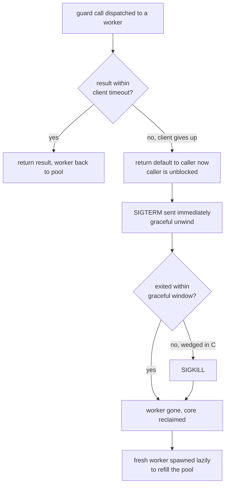
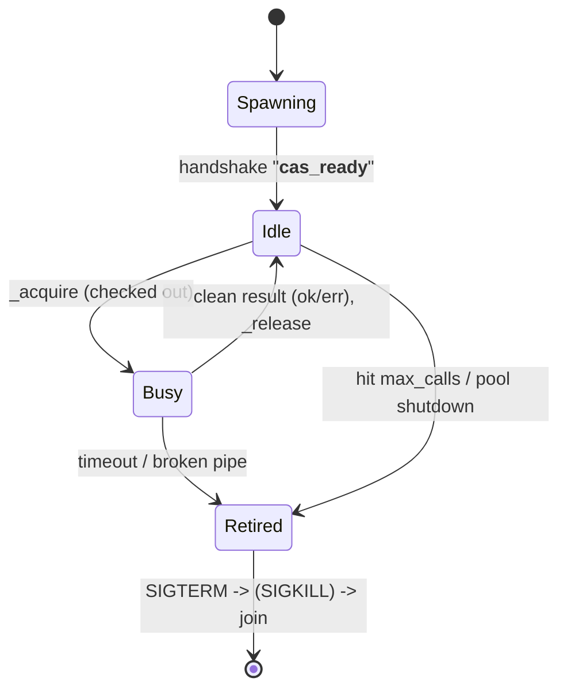

# AlgeBench CAS Execution Model — Killable, Process-Isolated sympy

> Design document for the process-isolated, killable CAS guard (issue #386) that
> bounds heavy sympy work in the proof-grounding and proof-animation paths.

**Related docs:**

- [architecture.md](architecture.md) — Overall project architecture
- [proofs-model.md](proofs-model.md) — The step-by-step proof & derivation model
- [semantic-graph-module-design.md](semantic-graph-module-design.md) — Graph parsing/representation

Configuration reference (env vars) lives in [../AGENTS.md](../AGENTS.md) and
[../.env.local.example](../.env.local.example). The implementation is
`backend/experts/modules/proof_completion/cas_guard.py`.

---

## Why — the problem

The CAS grounding path (`step_grounding.py`) ranks each derivation transition by
running heavy sympy routines — `solveset`, `simplify`, `limit`, `nsimplify`,
`singularities`, `is_subset`. **These have no termination or complexity
guarantee.** An intermediate expression tree can blow up super-linearly, after
which the `O(tree-size)` compare/hash loop (`Basic.__eq__` + `@cacheit`) pins a
CPU core.

The original guard ran these under a shared `ThreadPoolExecutor` and waited with
`future.result(timeout=…)`. The fatal flaw: **you cannot kill a thread in
Python.** The timeout bounded only *waiting on the result*, not the computation.
A timed-out call kept its worker thread burning a core **forever** — surviving
the request that started it, accumulating across a session, and silently
degrading or exhausting the server. On a small cloud box (Render/HF: few cores,
tight RAM) a single runaway could render the service unusable, and it would go
unnoticed: no error, no crash, just rising CPU.

Observed in production-like testing: dev servers pinned at ~99% CPU, one for 29
minutes straight — far longer than any request — actively running sympy
(`PyObject_RichCompareBool`, `tuple_hash`), not deadlocked. A 2 s timeout
returned `TIMED_OUT`, yet the worker kept iterating millions of times per second
afterward.

**Goal:** a wall-clock budget must translate into the computation actually
*stopping* and the core being reclaimed — regardless of what expression the LM
emits — without making the caller wait on that cleanup.

## What — the solution in one paragraph

Run heavy sympy in a pool of **separate worker processes** and, on timeout,
**signal then kill** the worker so the OS reclaims the core. Because a process
(unlike a thread) can be `SIGKILL`ed unconditionally, a budget becomes a real
stop. The caller's wait (the "client timeout") is decoupled from the kill and
respawn, so a derive never blocks on a pathological step.

### The escalation ladder

Three rungs, each independently configurable:



1. **Client timeout** (`ALGEBENCH_CAS_CLIENT_TIMEOUT`, default = `ALGEBENCH_VERIFY_TIMEOUT` = 2 s) — the caller stops *waiting* and gets its `default` back. The grounding step degrades to "plausible / unverified".
2. **Graceful kill** — `SIGTERM` is sent (immediately at retire time); the worker's handler raises into the running sympy call, unwinding it cleanly. This interrupts any call executing Python bytecode (which sympy overwhelmingly is).
3. **Hard kill** (`ALGEBENCH_CAS_GRACEFUL_TIMEOUT`, default 1 s grace) — if the worker is wedged in an uninterruptible C routine and ignores `SIGTERM`, it is `SIGKILL`ed. The kernel tears it down unconditionally; the core is reclaimed no matter what.

The retired worker is **never reused** — a fresh one is spawned to refill the
pool. This also contains memory blow-ups (the bloated child RSS dies with it) and
keeps a pathological expression's sympy cache out of the long-lived server.

## How — architecture

### Components (all parent-side unless noted)

- **`guard(fn, *args, default=…, timeout=…)`** — the single choke point every
  heavy sympy call routes through. Picks the isolation mode and returns `default`
  on timeout/error (never raises).
- **`_CasPool`** — bounded, self-healing pool of worker processes.
- **`_Worker`** — a handle to one worker process + its parent-side pipe end.
- **`_worker_loop`** *(runs in the child)* — single-threaded job loop.
- **`_reaper`** — a small `ThreadPoolExecutor` that performs the blocking
  `join` + `SIGKILL` escalation **off the caller's thread**.

### The request/reply protocol

Each worker has its **own** duplex `multiprocessing.Pipe()` (pickle-framed,
length-prefixed binary frames). Three message kinds:

1. **Handshake** (once, at spawn): worker → parent sends `"__cas_ready__"` after
   it has imported and installed its signal handlers. The parent waits for this
   on a separate **spawn budget** (`ALGEBENCH_CAS_SPAWN_TIMEOUT`, default 30 s),
   so interpreter/import warm-up (expensive under `spawn`) is **never charged to
   a call's client timeout**.
2. **A call** (parent → worker): the 2-tuple `(fn, args)`. `fn` is a picklable,
   **module-level** function (pickled *by reference* — module + qualname); `args`
   are picklable sympy objects.
3. **A result** (worker → parent): `(status, payload)` where `status` is `"ok"`
   (payload = return value), or `"err"` (payload = a short error string).

**No correlation IDs.** A worker handles exactly one job at a time on a private
pipe, and is checked out exclusively for the duration of a call, so "the next
message on this pipe is my reply" is unambiguous. The one hazard that would need
IDs — a *stale* result from a timed-out worker arriving later — is eliminated by
**never reusing a timed-out worker** (its pipe is discarded with it). Timeout is
purely parent-side: if `conn.poll(client_timeout)` returns false, the parent
synthesizes a timeout, returns `default`, and retires the worker; the worker
keeps computing, oblivious, until the signal lands.

### Worker lifecycle



A healthy worker oscillates **Idle ↔ Busy** many times. It leaves the rotation
permanently only on: a timeout (wedged), a broken pipe (died), or hitting
`ALGEBENCH_CAS_MAX_CALLS` (default 200 — proactive recycle for cache/memory
hygiene). On retirement `_count` drops and the pool **self-heals lazily**: the
next acquire that finds no idle worker and is under `pool_size` spawns a fresh
one.

### Load distribution

There is **no dispatcher or round-robin** — calls pull from a shared idle queue
(a work-queue / "first free worker wins" model). `_acquire`:

1. take any idle worker (FIFO), else
2. if under `pool_size`, spawn a new one (lazy growth, handshake outside the
   lock so warm-up doesn't block other acquirers), else
3. wait up to `ALGEBENCH_CAS_ACQUIRE_TIMEOUT` for one to be released; if none
   frees up, **degrade to `default`** (never block forever).

This self-balances: a fast worker returns to the queue and is reused; a busy one
simply isn't in the queue, so it isn't piled on.

### Observability

The guard is **silent on the happy path** — it logs only exceptional events, so
silence means healthy. Logs are tagged so they're greppable in the shared server
log:

- `🧬 CAS` — parent-side subsystem events (timeout / SIGKILL / saturation).
- `🖥️` — output from / about a worker **subprocess** (carries its pid). A
  worker-startup hook also re-tags the child's own stderr (e.g. sympy warnings)
  and routes `warnings.warn` through logging, so child output is attributable.
- A timeout logs the **op + args + duration**, capturing the exact pathological
  input (e.g. `is_subset(ConditionSet(…), ImageSet(…))`).
- DEBUG lines confirm the pool came up and each worker spawned (visible with
  `--debug`).

## Design rationale — the "why nots"

### Why processes, not threads?
sympy grounding is **CPU-bound**, and CPython's **GIL** lets only one thread run
bytecode at a time per process — so threads give zero CPU parallelism for it, and
(the core issue) a thread can't be killed. Separate processes each have their own
interpreter and GIL: `N` workers = `N` cores genuinely computing, and each can be
`SIGKILL`ed. Threads remain the right tool for the *I/O-bound* parts (the LM call,
the pipe wait) because the GIL is **released** during blocking I/O — that's why
the server's sync handlers in uvicorn's threadpool already overlap requests for
free.

### Why not async?
asyncio is a single-threaded event loop for overlapping **I/O waits**; it adds no
CPU parallelism (still one thread, one GIL). The parallelism ceiling for sympy is
the process pool (≈ cores), not the concurrency model. Converting the sync,
CPU-bound, process-offloaded pipeline to async would be a viral refactor
(grounding → reward → animation → handler, plus bridging the largely-sync
dspy/litellm LM stack) for **identical** performance. async's real win —
tens of thousands of cheap concurrent connections — never applies at this scale
(bounded by LM cost/rate limits and small boxes).

### Why is the client timeout separate from recycle/recovery?
So the caller is unblocked **immediately** at the client timeout while the
(slower) `SIGTERM → grace → SIGKILL → join` runs in the background on the reaper
threadpool. `SIGTERM` is sent **synchronously at retire time** (cheap,
non-blocking) so a runaway starts unwinding at once even under a burst of
timeouts; only the blocking join + escalation is deferred to the reaper.

### The picklability contract
In `process` mode `fn` and its args cross a process boundary via pickle, so `fn`
must be a **module-level** function (lambdas/closures aren't picklable). This is
why `step_grounding`'s inline checks were refactored into top-level `_op_*`
helpers. `fn` is pickled *by reference*, so the worker re-imports the defining
module — its **code is never shipped**, only "which function + its args". (We use
stdlib `pickle`, not `cloudpickle`; the by-reference approach is lighter and the
explicit helper set doubles as documentation of what may run in a worker.)

### Complexity pre-gate (defense in depth)
Before calling the heavy routines, a cheap `O(n)` size check
(`ALGEBENCH_CAS_MAX_OPS`, default 2500 atoms+ops) skips obviously-intractable
expressions, degrading them to "plausible" without spawning work at all. The
killable guard is the hard guarantee; the pre-gate just spares it (and the
kill/respawn churn) the monsters that are clearly too big.

## Security — the op allow-list

The guard executes only callables that have been explicitly **registered** as
safe ops; anything else is refused (logged at ERROR, `default` returned) rather
than run. Ops register at import via the decorator:

```python
from .cas_guard import cas_register_safe_function

@cas_register_safe_function
def _op_is_subset(a, b):
    return a.is_subset(b)
```

`guard(fn, …)` checks `fn` against this allow-list before dispatch, in every
isolation mode. The registered set is the closed list of vetted ops: `sympy_equiv`
and `graph_to_sympy` (in `grounding.py`), and the `_op_*` helpers, `_solution_set`,
and the `_op_solveset` / `_op_singularities` / `_op_limit` wrappers (in
`step_grounding.py`).

This is **defense in depth**, not the primary boundary. By construction, user and
agent input only ever becomes the *arguments* to a guarded call (sympy expressions
parsed from their LaTeX) — never the *callable*, which is always one of our
hardcoded functions. The pickle stream is parent→worker over a private pipe, not
attacker-injectable. The allow-list exists so that even a future code change that
tried to pass an unexpected (e.g. user-influenced) callable to `guard` is
hard-stopped instead of executed.

Note on scope: the worker is **not** a privilege sandbox — it runs as the same OS
user with the same permissions (no seccomp, no jail). cas_guard bounds *resources
and runaways*, not *capabilities*; the capability boundary for untrusted
expressions remains the parser / [sandbox model](sandbox-model.md). What cas_guard
does add is **containment**: if a hostile expression ever exploited a sympy bug, it
would run in an isolated, killable, resource-bounded child that is discarded after.

## Isolation modes (`ALGEBENCH_CAS_ISOLATION`)

| Mode | Behavior | Use |
| --- | --- | --- |
| `process` *(default)* | Full killable ladder above | Production / the real fix |
| `thread` | Legacy shared `ThreadPoolExecutor`; bounds only the *wait* (rungs 2–3 are no-ops) | The **test suite** (keeps heavy sympy monkeypatchable in-process; no per-worker spawn cost); offline training where inputs are trusted and IPC overhead is undesirable |
| `inline` | Direct call, no isolation, no timeout | Pure-logic unit tests |

## Configuration

All env vars (sensible defaults; nothing needs setting for normal use) — see
[../AGENTS.md](../AGENTS.md) for the canonical table: `ALGEBENCH_CAS_ISOLATION`,
`…_CLIENT_TIMEOUT` (defaults to `ALGEBENCH_VERIFY_TIMEOUT` for back-compat),
`…_GRACEFUL_TIMEOUT`, `…_POOL_SIZE` (default `min(4, cores−1)`), `…_MAX_CALLS`,
`…_START_METHOD` (forkserver on Linux / spawn elsewhere), `…_SPAWN_TIMEOUT`,
`…_ACQUIRE_TIMEOUT`, `…_MAX_OPS`.

## Failure semantics — always safe, never a false verdict

A timeout/error never raises and never produces a *wrong* answer:

- `guard` returns the caller's `default`.
- In grounding, that `default` is chosen so the step degrades to the **honest
  neutral** — `relation="unknown"` → `Tier.BLUE` (Plausible). A timeout can never
  yield a false **Refuted** (only a concrete positive finding does) or a false
  **Verified**.
- The animation build's confidence pass is isolated — any failure degrades the
  whole pass to a uniform GRAY rather than breaking the derivation.
- Second chances by context: at inference, a CAS-undecided step may be rescued by
  the domain judge (#385); in training, it lowers the grounding score and becomes
  **retry feedback** so the model learns to emit CAS-verifiable steps.

## Operational notes (cloud)

- **Pool size is capped at `cores−1`** so guarded sympy can't oversubscribe the
  box and the web/event loop always keeps a core. On a 1–2 vCPU instance that's
  1 worker; raise `ALGEBENCH_CAS_POOL_SIZE` on a bigger box for more parallel
  grounding.
- **Multiple web workers multiply the pool.** Running uvicorn with `--workers W`
  gives **W independent pools**; size so `W × pool_size ≤ cores−1`.
- **Memory.** Each worker imports sympy (~100–150 MB). The small pool + `max_calls`
  recycling keep this bounded over a long-running server.
- **Honest limit.** On a strict 1-core box under heavy concurrency, grounding
  throughput is one worker — some steps degrade to "unknown" rather than fully
  verified (deliberate: the server stays up). The next lever there is **caching
  grounding results** (issue #386 option D), not more parallel sympy on one core.

## Testing

- `tests/backend/experts/test_cas_guard.py` — config parsing, all three modes,
  **the killable guarantee** (a non-terminating CPU input is stopped and the core
  reclaimed, no lingering worker), client-timeout separation, graceful-vs-hard
  kill, recycling, saturation, concurrency, log tagging.
- `tests/backend/experts/cas_workers.py` — picklable helpers for the process tests.
- `tests/backend/experts/test_step_grounding.py` — process-mode round-trip of the
  real ops; complexity pre-gate; timeout degradation.
- The suite runs in `thread` isolation by default (`tests/conftest.py`); process
  mode is exercised explicitly.

## File map

| File | Role |
| --- | --- |
| `backend/experts/modules/proof_completion/cas_guard.py` | The guard, pool, worker, reaper, config |
| `backend/experts/modules/proof_completion/step_grounding.py` | Routes grounding through the guard; `_op_*` helpers; complexity pre-gate |
| `backend/experts/handlers/proof_animation/animation.py` | Guards `graph_to_sympy` at animation-build time |
