# Learning Plan — Proposal

> A navigation layer that builds a path from wherever the learner is to a concept they don't understand yet, using AlgeBench's existing content.

**Issue:** [#683](https://github.com/ibenian/algebench/issues/683) · **Depends on:** stable lesson ids ([#684](https://github.com/ibenian/algebench/pull/684), merged)
**Status:** plan core, navigator and IndexedDB store implemented (`src/plan-core.ts`, `src/plan-store.ts`, [#686](https://github.com/ibenian/algebench/pull/686)); the plan panel UI follows in a separate PR.
**Principle:** a navigation layer over existing AlgeBench content, not an AI-written syllabus. The AI chooses content; it never writes content or links.

---

## 1. The current architecture, as it matters here

### Content that can be referenced

| Content | How to address it | Stable? | Notes |
|---|---|---|---|
| Lesson | `builtin=<file stem>` | ✅ | Published: 18 in `scenes/`. Drafts are `draft/<stem>` and duplicate some published lessons |
| Scene / step | `sc=`, `st=` | ✅ | Explicit `id` everywhere since #684 |
| Proof / proof step | `pf=`, `ps=` | ✅ | Proof ids are unique across the whole lesson |
| Glossary term | *none* | ⚠️ key only | Keyed per lesson plus imported domain glossaries; no deep-link param |
| Semantic-graph node | `nodes=` (inside `pf`/`ps`) | ❌ | Counter ids like `__multiply_2` shift when a graph is rebaked; some graphs are only derived on demand |
| Standalone proof library | `pa=<domain>/<name>` | ✅ | 21 proofs; its `prerequisites` are free-text strings |
| Uploaded lesson | — | ❌ | Can't be deep-linked or stored |

There is **no** prerequisite, "related", or concept metadata anywhere, and no embeddings. The published lessons hold about 916K characters (~230K tokens) of AI-useful text, so they can't all go into one prompt. A titles-and-descriptions index of every scene, step, proof and glossary term is about 200K characters across all lessons, which is workable once it is pre-filtered to a few relevant lessons.

### Navigation

- **`applyViewState(vs)`** (`src/view-state-bridge.ts`) is the only way to jump. It loads another lesson if `builtin` differs, then resolves `sc`/`st`/`pf`/`ps`, sliders, camera and panel.
- **It fails silently.** An unresolved id falls back to the current scene (or the scene's base step), and a failed lesson load leaves the old lesson in place. The caller has to check where it actually landed with `captureViewState()`.
- **Every apply forces the right panel to Doc or Chat and closes the proof panel** unless the view says otherwise.
- **An apply replaces the URL in place.** For Back to undo a plan jump, call `pushView()` after it.
- **Navigation already announces itself** through `algebench:navchange` and `proofchange` events, which is the hook for tracking plan progress.

### AI

- **`build_scene` is the pattern to copy.** It is a registered handler behind `POST /api/expert/<name>`, with a pydantic request model, and every prompt input is rendered to a bounded string (`format.py`). The model runs through DSPy `Predict` with LineAdapter and gets one retry on a parse error. A validation step in code (compose) gets one retry with the refusal reason passed back. Replies take one of four shapes: `result`, `question`, `reason`, or `fallback_to_chat`.
- **The model never supplies ids.** Code mints them or carries them over.
- **The tutor chat already navigates through client-side tools** (`navigate_to`, `navigate_proof`, ...). A plan tool fits that same pattern.

### UI

- **The left dock has tabs** (`Scenes | Math`).
- **The right panel has tabs** (`Doc | Chat`). `switchPanelTab` is generic.
- **`createDockablePanel()`** gives a draggable, collapsible, persisted floating panel.
- **Every "Ask AI" sparkle goes through `makeAiAskButton()`**: objects, glossary tips, proof steps, doc paragraphs and graph nodes. That is one place to add a second action.
- **No IndexedDB and no shared storage helper exist yet.**

---

## 2. Proposed architecture

```mermaid
flowchart LR
    A[Learner hits a gap] --> B[Plan request, target plus where they are]
    B --> C[learning_plan expert]
    C --> D[Catalog, built by the server from lesson JSON]
    D --> E[Preselect a few lessons by text match]
    E --> F[LLM picks handles plus why]
    F --> G[Validate in code, handles to refs]
    G --> H[Plan returned to client]
    H --> I[Client builds ViewState from each ref]
    I --> J[Saved in IndexedDB]
    J --> K[Plan UI, jump to step, track progress]
```



1. **Catalog (server).** Walk the raw lesson JSON of published lessons, without `_load_scene`, which would trigger costly graph autofill, using `iter_id_targets` plus the glossary. Cache it per file by mtime, as the existing lesson index does. Each entry has an opaque handle such as `L3.S2.T4`, a kind, a title, a one-line description, and the canonical ref.
2. **Preselection (server, no LLM).** Score lessons against the target text using the same signals as the lesson picker: titles, scene titles, description text, glossary terms and aliases. Always include the current lesson and take the top 3–4 lessons, then render their catalog entries with the existing bounding helpers (`_line`, `_clip`, "… (+N more)").
3. **Selection (LLM, one call).** Inputs: the target, where the learner is now, the bounded catalog, and what the learner already knows or has done. Outputs: `is_plan`, `question`, `title`, and `steps: [{handle, why}]`.
4. **Validation (code).** Every handle must be in the catalog that was sent. Drop duplicates, cap the plan at about 8 steps, and require a non-empty `why`. If the plan comes out empty or mostly invalid, retry once with the reason. Code turns handles into refs. There is no "return" step to append: getting back is the navigator's job (§4).
5. **Client.** Turn each ref into a `ViewState` in code (`serializeViewState`); a URL from the model is never used. Save the plan to IndexedDB and render it.

**Why not RAG or embeddings in v1:** the catalog is small and structured, and text preselection plus one LLM pass over a bounded catalog is enough. Add embeddings only if preselection misses relevant lessons in practice, and the handle, catalog and validate contract would stay the same.

---

## 3. Data model

A plan is a **progress keeper**. It knows its steps, how far the learner has got, where the learner is right now (possibly several sub-plans deep), and how to get back to where each level was entered.

A complete sample export, a plan with content, glossary and proof steps, a nested sub-plan and a linked plan (all steps still to do; exports carry no walk), is in [`learning-plan-sample.json`](learning-plan-sample.json). A test keeps it valid against `parsePlanFile`.

- A content step's **ref** is the source of truth. Its **view** is derived from the ref and may add presentation state (slider values, camera preset).
- A **sub-plan step** holds another plan instead of content, either **nested** (the plan lives inside this step) or **referenced** (a pointer to another saved plan).

```ts
interface LearningPlan {
  schemaVersion: 1;
  id: string;                      // uuid
  title: string;                   // "Understand terminal velocity"
  target: {
    text: string;                  // what the learner asked for
    origin: ViewState;             // where they were when they asked
  };
  steps: PlanStep[];
  status: 'active' | 'complete';   // the learner marks complete; delete removes the record
  nav?: PlanNav;                   // where the learner is, when this plan is being walked
  createdAt: number;
  updatedAt: number;
  completedAt?: number;
}

type PlanStep = ContentStep | SubplanStep;

interface StepBase {
  id: string;
  title: string;                   // copied from the catalog at creation, refreshed on load
  why: string;                     // why this step helps reach the target
  state: 'todo' | 'visited' | 'done' | 'skipped';
  source: 'ai' | 'learner';
}

interface ContentStep extends StepBase {
  kind: 'scene' | 'step' | 'proof' | 'proofStep' | 'glossary';
  ref: ContentRef;
  view: ViewState;                 // built from ref (+ optional sliders/cv)
  lastView?: ViewState;            // where the learner last was while on this step; resume lands here
}

interface SubplanStep extends StepBase {
  kind: 'subplan';
  sub: { nested: LearningPlan }    // lives and dies with this step
     | { planId: string };         // another saved plan; its progress is shared wherever it's used
}

interface ContentRef {
  lesson: string;                  // builtin id
  sc?: string; st?: string; pf?: string; ps?: string;
  glossary?: string;               // key, resolved in the lesson + its domain glossaries
}

/** Where the learner is: a stack of frames, outermost plan first. */
interface PlanNav {
  frames: NavFrame[];
}

interface NavFrame {
  planId: string;                  // the plan this frame walks (this one, a nested plan, or a referenced plan)
  stepId: string;                  // its current step
  cameFrom: ViewState;             // the view the learner left to enter this frame; Return lands here
}
```

**Why a frame stack.** Each level of recursion needs to remember its own position and its own way back. The top frame is where the learner is. Each frame below it is a suspended plan, parked on the sub-plan step that was entered. The whole path survives reloads because it's stored on the outermost plan (`nav`).

### 3a. Sample JSON

The worked example is **"Understand terminal velocity"**, asked from the *Terminal Velocity* step of the atmospheric-entry lesson. All ids below are real.

**① What the client sends:** `POST /api/expert/learning_plan`

```json
{
  "target": { "text": "Understand terminal velocity" },
  "origin": {
    "builtin": "atmospheric-entry-physics",
    "sc": "splashdown-dynamics",
    "st": "terminal-velocity"
  },
  "scope": "published",
  "known": [],
  "messages": []
}
```

**② What the model sees:** a bounded excerpt of the catalog. Handles are opaque, and nothing here can be turned into a URL.

```text
LESSON L1  Atmospheric Entry Physics
  L1.S0     scene  The Forces of Reentry — drag, lift and gravity on a capsule
  L1.S0.T1  step   Aerodynamic Drag — drag grows with air density and the square of speed
  L1.S1     scene  The Exponential Atmosphere
  L1.S1.T1  step   The Exponential Profile — density falls off exponentially with height
  L1.S5.T2  step   Terminal Velocity — where drag balances weight
  L1.P7     proof  Terminal Velocity
  L1.P7.4   pstep  Terminal velocity means zero acceleration
  L1.P7.5   pstep  So the forces must balance
  L1.P7.9   pstep  Solve for Terminal Velocity
  L1.G14    term   drag coefficient — C_D, how a shape resists the flow
  … (+41 more in this lesson)
LESSON L2  … (preselected by text match)
```

**③ What the model returns:** handles and reasons only.

```json
{
  "is_plan": true,
  "question": "",
  "title": "Understand terminal velocity",
  "steps": [
    { "handle": "L1.S0.T1", "why": "Terminal velocity is where drag cancels weight, so start with what drag is and what it depends on." },
    { "handle": "L1.G14",   "why": "The drag coefficient packs the capsule's shape into one number that appears in the final formula." },
    { "handle": "L1.S1.T1", "why": "Drag depends on air density, which changes with altitude, so terminal velocity changes as the capsule falls." },
    { "handle": "L1.P7.5",  "why": "Zero acceleration means the forces balance, which is the condition that defines terminal velocity." },
    { "handle": "L1.P7.9",  "why": "Solving the balance gives the formula; each factor now maps to something you've seen." }
  ]
}
```

A handle that isn't in the catalog the model was given (for example `L1.S9.T4`) is dropped during validation and never reaches the client.

**④ What is saved:** one IndexedDB record. Code builds `ref`, `view` and `title` from each handle and adds `nav` when the learner starts walking the plan.

In this snapshot the learner has:
1. done `s1`;
2. looked at `s2`;
3. got stuck on force balance at `s4`;
4. entered its **nested** sub-plan, where they're now on step `n1`.

Step `s3` is a **reference** to a separate saved plan about air density.

```json
{
  "schemaVersion": 1,
  "id": "3f6c2a9e-8d41-4b7a-9f0e-2c5d7e1a4b88",
  "title": "Understand terminal velocity",
  "target": {
    "text": "Understand terminal velocity",
    "origin": { "builtin": "atmospheric-entry-physics", "sc": "splashdown-dynamics", "st": "terminal-velocity" }
  },
  "status": "active",
  "createdAt": 1790640000000,
  "updatedAt": 1790640780000,
  "steps": [
    {
      "id": "s1",
      "kind": "step",
      "title": "Aerodynamic Drag",
      "why": "Terminal velocity is where drag cancels weight, so start with what drag is and what it depends on.",
      "ref":  { "lesson": "atmospheric-entry-physics", "sc": "the-forces-of-reentry", "st": "aerodynamic-drag" },
      "view": { "builtin": "atmospheric-entry-physics", "sc": "the-forces-of-reentry", "st": "aerodynamic-drag" },
      "state": "done",
      "source": "ai"
    },
    {
      "id": "s2",
      "kind": "glossary",
      "title": "drag coefficient",
      "why": "The drag coefficient packs the capsule's shape into one number that appears in the final formula.",
      "ref":  { "lesson": "atmospheric-entry-physics", "glossary": "drag coefficient" },
      "view": { "builtin": "atmospheric-entry-physics" },
      "state": "visited",
      "source": "ai"
    },
    {
      "id": "s3",
      "kind": "subplan",
      "title": "Why air gets thinner with height",
      "why": "Drag depends on air density, which changes with altitude, so terminal velocity changes as the capsule falls.",
      "sub": { "planId": "7b2e4d10-93c6-4f85-a1d2-6e0b8c3f5a19" },
      "state": "todo",
      "source": "learner"
    },
    {
      "id": "s4",
      "kind": "subplan",
      "title": "Why zero acceleration means balanced forces",
      "why": "Terminal velocity is defined by the forces balancing; this makes that step obvious.",
      "state": "visited",
      "source": "ai",
      "sub": {
        "nested": {
          "schemaVersion": 1,
          "id": "a81d0c55-2e3f-4c19-b6a7-5d9e0f1c2b34",
          "title": "Newton's second law",
          "target": {
            "text": "Why zero acceleration means the forces balance",
            "origin": { "builtin": "atmospheric-entry-physics", "sc": "splashdown-dynamics", "pf": "terminal_velocity", "ps": "so-the-forces-must-balance", "pp": true, "panel": "chat" }
          },
          "status": "active",
          "createdAt": 1790640500000,
          "updatedAt": 1790640780000,
          "steps": [
            {
              "id": "n1",
              "kind": "proofStep",
              "title": "Newton's second law",
              "why": "F = ma: if a is zero, the net force is zero, so the forces cancel.",
              "ref":  { "lesson": "atmospheric-entry-physics", "sc": "splashdown-dynamics", "pf": "terminal_velocity", "ps": "newton-s-second-law" },
              "view": { "builtin": "atmospheric-entry-physics", "sc": "splashdown-dynamics", "pf": "terminal_velocity", "ps": "newton-s-second-law", "pp": true, "panel": "chat" },
              "state": "visited",
              "source": "ai"
            },
            {
              "id": "n2",
              "kind": "proofStep",
              "title": "So the forces must balance",
              "why": "With the net force at zero, weight and drag must be equal and opposite.",
              "ref":  { "lesson": "atmospheric-entry-physics", "sc": "splashdown-dynamics", "pf": "terminal_velocity", "ps": "so-the-forces-must-balance" },
              "view": { "builtin": "atmospheric-entry-physics", "sc": "splashdown-dynamics", "pf": "terminal_velocity", "ps": "so-the-forces-must-balance", "pp": true, "panel": "chat" },
              "state": "todo",
              "source": "ai"
            }
          ]
        }
      }
    },
    {
      "id": "s5",
      "kind": "proofStep",
      "title": "Solve for Terminal Velocity",
      "why": "Solving the balance gives the formula; each factor now maps to something you've seen.",
      "ref":  { "lesson": "atmospheric-entry-physics", "sc": "splashdown-dynamics", "pf": "terminal_velocity", "ps": "solve-for-terminal-velocity" },
      "view": { "builtin": "atmospheric-entry-physics", "sc": "splashdown-dynamics", "pf": "terminal_velocity", "ps": "solve-for-terminal-velocity", "pp": true, "panel": "chat" },
      "state": "todo",
      "source": "ai"
    }
  ],
  "nav": {
    "frames": [
      {
        "planId": "3f6c2a9e-8d41-4b7a-9f0e-2c5d7e1a4b88",
        "stepId": "s4",
        "cameFrom": { "builtin": "atmospheric-entry-physics", "sc": "splashdown-dynamics", "st": "terminal-velocity" }
      },
      {
        "planId": "a81d0c55-2e3f-4c19-b6a7-5d9e0f1c2b34",
        "stepId": "n1",
        "cameFrom": { "builtin": "atmospheric-entry-physics", "sc": "splashdown-dynamics", "pf": "terminal_velocity", "ps": "so-the-forces-must-balance", "pp": true, "panel": "chat" }
      }
    ]
  }
}
```

Reading `nav`: the learner is on step `n1` of the nested plan *Newton's second law*, entered from the proof step `so-the-forces-must-balance`. Under it, the main plan is parked on `s4`. The bottom frame's `cameFrom` is the Terminal Velocity step, where the learner first asked.

A content step's `view` serializes to an ordinary deep link. `n1`, for example, becomes:

```text
/?builtin=atmospheric-entry-physics&sc=splashdown-dynamics&pf=terminal_velocity&ps=newton-s-second-law&pp=1&panel=chat
```

**⑤ The referenced plan.** Step `s3` points to this separate saved plan. The learner may have made it earlier, or it may be linked from several plans. Its progress is its own and is shared by every plan that references it.

```json
{
  "schemaVersion": 1,
  "id": "7b2e4d10-93c6-4f85-a1d2-6e0b8c3f5a19",
  "title": "Why air gets thinner with height",
  "target": {
    "text": "Why does air density drop with altitude?",
    "origin": { "builtin": "atmospheric-entry-physics", "sc": "the-exponential-atmosphere" }
  },
  "status": "active",
  "createdAt": 1790550000000,
  "updatedAt": 1790550300000,
  "steps": [
    {
      "id": "r1",
      "kind": "proofStep",
      "title": "Hydrostatic Equilibrium",
      "why": "Each layer of air holds up the weight of the air above it.",
      "ref":  { "lesson": "atmospheric-entry-physics", "sc": "the-exponential-atmosphere", "pf": "exponential_atmosphere_derivation", "ps": "hydrostatic-equilibrium" },
      "view": { "builtin": "atmospheric-entry-physics", "sc": "the-exponential-atmosphere", "pf": "exponential_atmosphere_derivation", "ps": "hydrostatic-equilibrium", "pp": true, "panel": "chat" },
      "state": "done",
      "source": "ai"
    },
    {
      "id": "r2",
      "kind": "step",
      "title": "The Exponential Profile",
      "why": "Putting it together gives density falling off exponentially with height.",
      "ref":  { "lesson": "atmospheric-entry-physics", "sc": "the-exponential-atmosphere", "st": "the-exponential-profile" },
      "view": { "builtin": "atmospheric-entry-physics", "sc": "the-exponential-atmosphere", "st": "the-exponential-profile" },
      "state": "todo",
      "source": "ai"
    }
  ]
}
```

**Storage.** IndexedDB database `algebench-plans` with a `plans` store (key: `id`; indexes: `updatedAt`, `status`), reached through a `planStore` interface (`list`, `get`, `save`, `delete`).
- A nested plan is stored inside its parent's record.
- A referenced plan is its own record.
- The pure parts (types, ref → ViewState, the navigator reducer, progress rollup, landing check) go in `src/plan-core.ts` with `node --test` tests, as `view-state.ts` and `nav-history-core.ts` do.
- `localStorage` holds only the id of the plan being walked and the panel state.
- Plans can be exported and imported as JSON. A referenced plan is included in the export.

**Staleness.** When a plan loads, check each ref against the lesson index (`/api/scenes`) and the loaded lesson. A missing ref shows as "content moved"; a missing referenced plan shows as "plan deleted". Neither ever jumps somewhere random.

---

## 4. The plan navigator: position, sub-plans, return, progress

The navigator is a small state machine over `nav.frames`. Every action changes the frame stack, updates step states, and then navigates, always to a view recorded in the plan.

| Action | Frame stack | Step state | Goes to |
|---|---|---|---|
| **Forward ›** | top frame moves to the next step | current step → `done`; next step `todo` → `visited` | next step's `lastView ?? view` |
| **‹ Back** | top frame moves to the previous step | unchanged | previous step's `lastView ?? view` |
| **Enter ↘** (on a sub-plan step) | push `{planId: sub-plan, stepId: its first unfinished step, cameFrom: current view}` | sub-plan step → `visited` | that step's view |
| **Return ⤴** | pop the top frame | **unchanged, nothing is completed** | the popped frame's `cameFrom` |
| **Forward on a sub-plan's last step** | sub-plan → `complete` (its own walk cleared); pop | parent's sub-plan step → `done` | the popped frame's `cameFrom` |
| **Return on the outermost frame** | clear `nav` (the plan stays active) | unchanged | that frame's `cameFrom`: where the walk was started from (by default `target.origin`, where the learner first asked) |
| **Jump to any step** (click in the list) | top frame moves there | that step `todo` → `visited` (nothing is completed) | its `lastView ?? view` |

- **"Knows where the user is."** On `algebench:navchange`, `proofchange`, slider and camera settle events, the current step's `lastView` is updated from `captureViewState()`. Coming back to a step (Back, Return, or a reload) lands where the learner actually left it, not just at the step's start.
- **The plan follows the learner, however they move.** Scene tree, proof panel, Math view or the plan's own buttons: on each navigation the plan checks where the learner landed.
  - **On the current step:** it updates that step's resume point.
  - **On another content step of the plan being walked, or of a plan further out on the frame stack:** the plan moves there and marks it visited. It leaves any sub-plans above that level the way Return does, completing nothing. The innermost level with a match wins; within it, the most specific ref (a proof step over its scene), then the nearest step after the current one.
  - **What doesn't count:** glossary steps never match, because they name only a lesson. A sub-plan the learner hasn't entered isn't entered for them. The plan's own jumps don't count as the learner moving.
- **Wandering off is allowed.** Anywhere that isn't a plan step changes nothing: the navigator shows "Back to step" and the frame stack is unchanged.
- **Jump mechanics.** First `pushView(view)` (without the camera, which history never carries), then `applyViewState(view)`. The order matters: `applyViewState` rewrites the *current* history entry, so pushing first keeps the view the learner left as the entry Back returns to. Then compare where it landed with the step's `sc`/`st`/`pf`/`ps`, and show a notice if it didn't land.
- **Progress.**
  - A content step counts 1 when it's `done` or `skipped`.
  - A sub-plan step counts as its sub-plan's completion fraction, computed recursively. A referenced plan contributes its own shared progress.
  - The plan shows "3 of 5 · 64%" plus a breadcrumb of the frames: *Understand terminal velocity › Newton's second law › step 1 of 2*.
- **Recursion limits.**
  - Entering a referenced plan that's already on the frame stack is refused, because it would be a cycle.
  - Nesting depth is capped (e.g. 4) to keep the breadcrumb readable.
- **Mark complete.** It sets `status: complete` and `completedAt` and clears `nav`. Step states are kept as history. A complete plan stays in the list, can be reopened, and a plan that references it counts it as done.
- **Delete** (with confirmation). It removes the record, and its nested sub-plans go with it. Referenced plans are not touched. Other plans that reference the deleted one show "plan deleted" on that step, with a remove action.
- **Where sub-plans come from.**
  1. "I'm stuck here" on a step asks the expert for a plan targeting that step's concept. The result becomes a nested sub-plan inserted as a new step (or attached to the current one), and is entered immediately.
  2. "Link a saved plan" inserts a reference to an existing plan.
  3. The learner can turn any plan into a referenced one to reuse it elsewhere.

---

## 5. UI and UX (exploration comes first)

- **The plan navigator** is a mini-player built with `createDockablePanel`, shown only while a plan is being walked.
  - Controls: breadcrumb, **‹ Back · Forward ›**, **Return ⤴**, and **Enter ↘** when the current step is a sub-plan.
  - It also shows the current step's `why`, a progress bar, and a menu: *I'm stuck here*, *Mark step done / skip*, *Mark plan complete*.
  - It collapses to a pill: "Terminal velocity › Newton · 1/2 · 64%  ‹ ›".
- **A "Plan" tab in the left dock (`Scenes | Math | Plan`)**:
  - **Plans list:** active and complete plans with progress bars, plus *Continue*, *Mark complete* and *Delete* on each.
  - **Selected plan:** a tree view where sub-plans expand in place. Each step shows its `why` and state, and can be edited, reordered, skipped or deleted. Steps can be added with *Link a saved plan* or *Add this view*.
  - **Tools:** a target input ("I want to understand…") and export/import.
  - The dock is already the "where am I, where can I go" surface, and the tab stays visible next to Chat.
  - Caveat: the dock is hidden when a lesson has no scene tree, so its visibility rule needs a small change.
- **Entry points** (nothing opens on its own):
  1. **"Plan a path to this" next to every Ask-AI sparkle**, a sibling action added in `makeAiAskButton`. That one change covers objects, glossary tips, proof steps, doc paragraphs and graph nodes. If a plan is already being walked, it offers *new plan* or *add as a sub-plan here*.
  2. **The target input in the Plan tab.**
  3. **A `propose_plan` tutor tool** (later), run on the client like `build_scene`, so the chat can say "want me to make a plan for that?"
  4. **"Add this view to the plan"** next to Share, which saves `captureViewState({includeCamera:true})` as a learner step.
- **Glossary steps** show the definition inline in the plan card, taken from the catalog, with an Ask-AI button. A `gl=` deep-link param can come later.

---

## 6. MVP implementation plan (separate PRs)

| # | PR | Contents |
|---|---|---|
| 1 | **Catalog + `learning_plan` expert** | `handlers/learning_plan/{models,catalog,format,validate,handler}.py`, `modules/learning_plan/signature.py`; published lessons only; stubbed-LM tests including "invented handles are dropped"; discovery subprocess test; fixture: atmospheric-entry, the lesson that covers terminal velocity |
| 2 | **Plan core + store** | `plan-core.ts`: types, ref → ViewState, **navigator reducer** (Forward/Back/Enter/Return/jump over the frame stack), progress rollup, cycle/depth guards, landing check, all with node tests; `plan-store.ts` (IndexedDB, nested + referenced plans); a TS twin of the expert's reply with a parity test |
| 3 | **Plan UI** | Navigator mini-player, dock Plan tab (list, tree, complete/delete, link a saved plan), "Plan a path to this" in `makeAiAskButton`, target input, `lastView` tracking, export/import |
| 4 | **AI sub-plans + tutor tool** | "I'm stuck here" → nested sub-plan from the expert (target = the step's concept, `known` = the parent's done steps); `propose_plan` tutor tool |

PRs 1 and 2 are independent and can go in parallel. The navigator works without the AI: a learner can build plans and sub-plans by hand in PR 3.

---

## 7. Decisions to make before coding

1. **Scope in v1: current lesson only, or across lessons?** Recommendation: across **published** lessons, with preselection. The interesting bridges ("terminal velocity" needs drag and force balance) usually cross lessons. Drafts are excluded because they duplicate published lessons.
2. **What happens when content is thin.** "Terminal velocity" appears in only one lesson. The expert should be able to say "AlgeBench doesn't cover X well yet" (`reason`) instead of padding the plan with weak steps. Recommendation: allow it, and show it.
3. **Graph nodes excluded in v1** because their ids aren't stable. Revisit once node ids are stabilized for prebaked graphs.
4. **Glossary deep link (`gl=`).** Inline definitions in v1; add the param in v1.5 if glossary steps turn out to be common.
5. **Panel reset on jump.** Every jump forces Doc or Chat. Keep that (the plan lives in the dock, so nothing is lost), and have a proof step's view carry `pp` **and** `panel: "chat"`: the proof panel lives inside the Chat tab, so `pp` alone lands on Doc with the proof panel out of sight.
6. **Cost.** One LLM call per plan, behind the existing per-IP rate limit (60/min shared across experts). Consider a low reasoning effort (`scoped_lm`).
7. **Privacy.** Plans stay in the browser only; nothing goes to the server except the target text and the current view, per request.
8. **Does Forward mean "done"?** Proposed: yes. Forward marks the step done; Back and Return never change state, and a jump only marks a step it lands on as visited (never done); the learner can undo it or mark a step skipped. The alternative is a separate "Done" check with Forward only moving, which is more precise but adds a click per step.
9. **Finishing a sub-plan: land at `cameFrom`, or move the parent forward too?** Proposed: land at `cameFrom` with the parent parked on its (now done) sub-plan step, so the learner sees where they were and chooses to go on.

## 8. Risks

- **Catalog coverage decides plan quality.** Weak lesson descriptions mean weak picks, and the fix for that is better lesson metadata, not a smarter model.
- **Silent navigation failures** in `applyViewState`: handled by checking where each jump landed.
- **Prompt injection through lesson text.** Reuse `build_scene`'s `_line`/`_clip` sanitizing, and keep every input a string.
- **Plans going stale as lessons change.** Explicit ids (#684) make this rare; the load-time check makes it visible.
