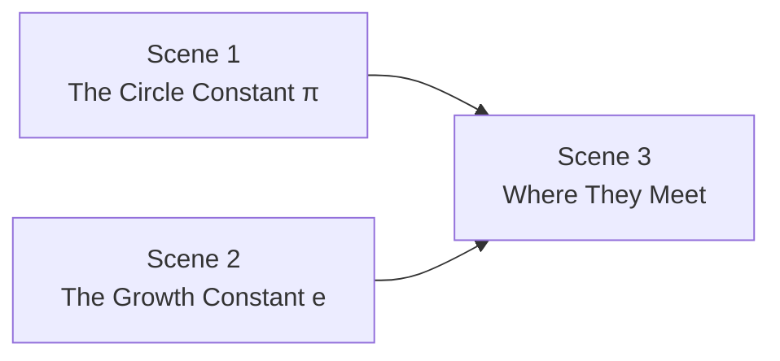

# Content Proposal: π and e Scene Collection

**Issue**: [#28](https://github.com/ibenian/algebench/issues/28)
**File**: `scenes/pi-and-e-constants.json`
**Branch**: `feat/pi-e-scenes`

---

## Overview

Three scenes, each with 3–4 progressive steps. The story moves from geometric first principles through analytical definitions to the surprising connections between the two constants.

---

## Scene 1 — The Circle Constant π

**Camera**: face-on 2D, z=6. Range: \[-2,2\] × \[-2,2\].

### Step 1 — The Unit Circle

*"π is the ratio of circumference to diameter — that's its definition."*

| Element | Type | Description |
|---|---|---|
| Axes | `axis` | x and y, range ±2 |
| Unit circle | `parametric_curve` | $x=\cos t,\; y=\sin t,\; t\in[0,2\pi]$ |
| Radius vector | `vector` | $(0,0)\to(1,0)$, label **r = 1** |
| Point at (1,0) | `point` | label **(1, 0)** |

**Info overlay**:
$$C = 2\pi r = {{toFixed(2*pi*1, 4)}} \qquad A = \pi r^2 = {{toFixed(pi, 4)}}$$

---

### Step 2 — Archimedes' Method (N-gon Approximation)

*"Long before calculus, Archimedes squeezed π between inscribed and circumscribed polygons."*

**Slider**: $N$ — number of sides (3 → 96, step 1, default 6)

| Element | Type | Expression |
|---|---|---|
| Inscribed polygon | `animated_polygon` | Vertices: $(\cos(2\pi k/N),\; \sin(2\pi k/N))$ for $k=0\ldots N-1$ |
| Perimeter label | info overlay | see below |

**Info overlay**:
$$\text{Sides: } N = {{N}} \qquad \text{Perimeter} = N \cdot 2\sin\!\left(\frac{\pi}{N}\right) \approx {{toFixed(N*2*sin(pi/N), 6)}} \xrightarrow{N\to\infty} 2\pi$$

As $N$ increases the perimeter converges to $2\pi \approx 6.283185\ldots$

---

### Step 3 — Leibniz Series

*"π hides inside the simplest alternating sum imaginable."*

**Slider**: $N$ — number of terms (1 → 300, step 1, default 10)

$$\frac{\pi}{4} = 1 - \frac{1}{3} + \frac{1}{5} - \frac{1}{7} + \cdots = \sum_{k=0}^{N-1} \frac{(-1)^k}{2k+1}$$

| Element | Type | Description |
|---|---|---|
| Target line | `line` | Horizontal at $y = \pi/4$, dashed |
| Partial sum point | `animated_vector` | From $(0,\pi/4)$ to $(N, \text{partial sum})$ as dot marker |
| Convergence curve | `parametric_curve` | Partial sum $S_k$ vs $k$ for $k=1\ldots N$ (JS IIFE loop) |

**Info overlay**:
$$S_N = \sum_{k=0}^{N-1} \frac{(-1)^k}{2k+1} = {{toFixed(partialLeibniz,6)}} \quad \Rightarrow \quad \pi \approx {{toFixed(4*partialLeibniz,6)}}$$

*(scene function `partialLeibniz` computes the sum via IIFE)*

---

### Step 4 — Basel Problem: $\sum 1/n^2 = \pi^2/6$

*"Euler shocked Europe in 1734: the squares of the integers sum to exactly $\pi^2/6$."*

**Slider**: $N$ — number of terms (1 → 500, step 1, default 20)

| Element | Type | Description |
|---|---|---|
| Target line | `line` | Horizontal at $y = \pi^2/6$ |
| Partial sum curve | `parametric_curve` | $\sum_{k=1}^{\lfloor t \rfloor} 1/k^2$ for $t\in[1,N]$ (JS IIFE) |

**Info overlay**:
$$\sum_{k=1}^{N} \frac{1}{k^2} = {{toFixed(baselSum, 6)}} \xrightarrow{N\to\infty} \frac{\pi^2}{6} = {{toFixed(pi*pi/6, 6)}}$$

---

## Scene 2 — The Growth Constant e

**Camera**: 2D face-on, z=8. Range: \[-1,5\] × \[-0.5,8\].

### Step 1 — Compound Interest Limit

*"e is what you get when interest compounds infinitely often."*

**Slider**: $n$ — compounding periods per year (1 → 500, step 1, default 1)

| Element | Type | Description |
|---|---|---|
| Curve $(1+1/n)^{nx}$ | `parametric_curve` | Growth curve for current $n$, $x\in[0,5]$ |
| Curve $e^x$ | `parametric_curve` | True exponential, fixed gold color |
| Vertical marker | `animated_vector` | At $x=1$: $(1,0)\to(1,(1+1/n)^n)$, shows current value |

**Info overlay**:
$$\left(1 + \frac{1}{n}\right)^n = {{toFixed((1+1/n)^n, 6)}} \xrightarrow{n\to\infty} e = 2.718281\ldots$$

The blue curve converges to $e^x$ (gold) as $n \to \infty$.

---

### Step 2 — Area Under 1/x

*"e is the unique number where the area under $1/x$ from 1 to e equals exactly 1."*

**Slider**: $b$ — upper limit (1.01 → 5, step 0.01, default $e \approx 2.718$)

| Element | Type | Description |
|---|---|---|
| Curve $y=1/x$ | `parametric_curve` | $x\in[0.2, 5]$ |
| Shaded area | `animated_polygon` | Region under $1/x$ from $x=1$ to $x=b$ |
| Marker at $b$ | `animated_vector` | Vertical line at $x=b$ |

**Info overlay**:
$$\int_1^b \frac{1}{x}\,dx = \ln(b) = {{toFixed(ln(b), 5)}} \quad \Longrightarrow \quad \text{area} = 1 \text{ when } b = e$$

---

### Step 3 — e^x Is Its Own Derivative

*"Among all exponential functions, $e^x$ is the only one equal to its own rate of change."*

**Slider**: $N$ — Taylor series terms (1 → 12, step 1, default 3)

| Element | Type | Description |
|---|---|---|
| True $e^x$ | `parametric_curve` | Gold, $x\in[-3,3]$ |
| Taylor approximation | `parametric_curve` | $\sum_{k=0}^{N-1} x^k/k!$ (JS IIFE), cyan |

**Info overlay**:
$$e^x \approx \sum_{k=0}^{N-1} \frac{x^k}{k!} = 1 + x + \frac{x^2}{2} + \cdots \quad (N={{N}} \text{ terms})$$

---

## Scene 3 — Where They Meet

**Camera**: face-on 2D for steps 1–2 (complex plane), 3D iso for step 3, 2D for step 4.

### Step 1 — e^(iθ) Traces the Unit Circle

*"Plug an imaginary number into e and out comes a rotation."*

**Slider**: $\theta$ — angle (0 → 6.283, step 0.05, default 0; animate loop, 4s)

| Element | Type | Description |
|---|---|---|
| Unit circle | `parametric_curve` | $(\cos t, \sin t)$, dashed guide |
| Rotating vector | `animated_vector` | $(0,0)\to(\cos\theta, \sin\theta)$, gold |
| Real projection | `animated_line` | $(\cos\theta,\sin\theta)\to(\cos\theta,0)$, shows $\cos\theta$ |
| Imaginary projection | `animated_line` | $(\cos\theta,\sin\theta)\to(0,\sin\theta)$, shows $\sin\theta$ |
| Point marker | `animated_vector` | Dot at $(\cos\theta,\sin\theta)$ |

Axes labelled **Re** (x) and **Im** (y).

**Info overlay**:
$$e^{i\theta} = \cos\theta + i\sin\theta \qquad \theta = {{toFixed(theta,3)}}$$
$$\text{Re} = {{toFixed(cos(theta),4)}} \qquad \text{Im} = {{toFixed(sin(theta),4)}}$$

---

### Step 2 — Euler's Identity

*"Set θ = π. The vector lands on −1. Add 1. You get zero. Five constants, one equation."*

$\theta$ locked to $\pi$ (no slider — fixed demonstration step).

| Element | Type | Description |
|---|---|---|
| Unit circle | `parametric_curve` | dashed |
| Vector to (−1, 0) | `vector` | $(0,0)\to(-1,0)$, gold |
| Point at (−1, 0) | `point` | labelled $e^{i\pi} = -1$ |
| +1 arrow | `vector` | $(-1,0)\to(0,0)$, shows $+1$ |
| Zero marker | `point` | at origin, labelled **0** |

**Info overlay**:
$$e^{i\pi} + 1 = 0$$
$$\underbrace{e}_{\text{growth}} \cdot \underbrace{i}_{\text{rotation}} \cdot \underbrace{\pi}_{\text{circle}} + \underbrace{1}_{\text{identity}} = \underbrace{0}_{\text{origin}}$$

---

### Step 3 — The Gaussian Integral

*"Integrate $e^{-x^2}$ over the whole real line and you get $\sqrt{\pi}$. The two constants are inseparable."*

**Camera**: 3D isometric. Range: \[-3,3\] × \[-3,3\] × \[0,1.2\].

| Element | Type | Expression |
|---|---|---|
| Gaussian surface | `parametric_surface` | $z = e^{-(u^2+v^2)}$, $u,v\in[-3,3]$, 64×64 |
| Cross-section curve | `parametric_curve` | $z = e^{-t^2}$ along $v=0$, gold |
| Floor contours | `parametric_curve` | $e^{-(t^2+c^2)}$ for several fixed $c$ values |

**Info overlay**:
$$\int_{-\infty}^{\infty} e^{-x^2}\,dx = \sqrt{\pi}$$
$$\left(\int_{-\infty}^{\infty} e^{-x^2}\,dx\right)^2 = \iint e^{-(x^2+y^2)}\,dA = \int_0^{2\pi}\!\int_0^{\infty} e^{-r^2}\,r\,dr\,d\theta = \pi$$

---

### Step 4 — The Normal Distribution

*"Normalize the Gaussian and you get the bell curve — $\pi$ and $e$ together in one formula."*

**Sliders**: $\mu$ (−2 → 2, default 0), $\sigma$ (0.2 → 2, default 1)

| Element | Type | Expression |
|---|---|---|
| Bell curve | `parametric_curve` | $\frac{1}{\sigma\sqrt{2\pi}}e^{-(t-\mu)^2/(2\sigma^2)}$, $t\in[-5,5]$ |
| 1σ fill | `animated_polygon` | Area under curve, $\mu\pm\sigma$ |
| 2σ fill | `animated_polygon` | Area under curve, $\mu\pm2\sigma$, lighter |
| 3σ fill | `animated_polygon` | Area under curve, $\mu\pm3\sigma$, lightest |
| Mean marker | `animated_vector` | Vertical at $\mu$ |

**Info overlay**:
$$f(x) = \frac{1}{\sigma\sqrt{2\pi}}\,e^{-\frac{(x-\mu)^2}{2\sigma^2}} \qquad \mu={{toFixed(mu,2)}},\;\sigma={{toFixed(sigma,2)}}$$
$$\mu \pm \sigma: 68.3\% \quad \mu\pm2\sigma: 95.4\% \quad \mu\pm3\sigma: 99.7\%$$

---

## Implementation Notes

- **Leibniz / Basel / compound interest** partial sums → scene `functions` with JS IIFE loops (same pattern as `hx()`/`hy()` in gradient-descent); marks file `"unsafe": true`
- **Gaussian surface** → `parametric_surface` with 64×64 samples, same shader pattern as gradient-descent terrain
- **Complex plane** axes labelled Re / Im using `text` elements
- **Euler's identity step** — no slider, purely demonstrative; consider a brief animated transition from step 1 using `virtualTime`
- **Normal distribution fills** — three overlapping `animated_polygon` regions at different opacities (lightest = 3σ drawn first)
- Once [#25 memoization](https://github.com/ibenian/algebench/issues/25) is implemented, the Leibniz/Basel scene functions benefit automatically (called multiple times in overlays)

---

## Scene Summary Table

| Scene | Steps | Key element types | Unsafe JS? |
|---|---|---|---|
| 1 — π | 4 | `parametric_curve`, `animated_polygon`, info overlays | Yes (Leibniz, Basel IIFE) |
| 2 — e | 3 | `parametric_curve`, `animated_polygon`, `animated_vector` | Yes (Taylor, compound interest IIFE) |
| 3 — They Meet | 4 | `parametric_curve`, `animated_vector`, `parametric_surface`, `animated_polygon` | No |
