# Semantic-graph visual partitioning

A design proposal for AlgeBench's semantic-graph renderer. The goal: partition the diagram into visually distinct regions — swimlanes, role-labeled edges, and spatial bias — so a reader can tell **which side of an operator is which** at a glance, without tracing edges back to the leaves.

This proposal unifies several related questions: how to make LHS / RHS stand out for `=`-type relations, how to mark direction on `⇒`, how to group multi-clause statements (#214), and how to label operands of multi-arity operators like `∫` and `\log`.

---

## The problem

Right now, all binary relations render as a node with two indistinguishable incoming edges. For `=` this is annoying. For `\implies` it's actively confusing — readers can't tell hypothesis from conclusion at a glance.

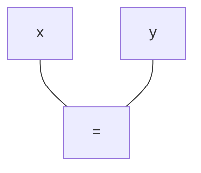

Same shape for `x = y`, `y = x`. (For asymmetric `\implies`, the rules below introduce arrows + role labels + swimlanes — three direction signals that resolve the ambiguity. For symmetric `=`, plain lines plus spatial bias are enough.) The renderer has the order, but doesn't show it.

---

## Proposal: attach a `role` to each edge

Every edge that comes into a binary operator gets a `role` field on the parser side. The renderer then decides whether to *show* that role as a text label or rely on geometry — based on whether the meaning is obvious from the operator glyph alone.

---

## Visual style reference

The proposal builds on AlgeBench's existing semantic-graph aesthetic (the `linalg-dark` theme) — it is **not** introducing a new visual language. The Mermaid snippets later in this document are schematic, simplified for the sake of the discussion; production rendering uses a richer vocabulary that's worth pinning down before getting into per-category rules.

The conventions:

- **Background:** deep navy / near-black. Variable nodes glow against it.
- **Variable nodes:** green-filled circles with a thin contrasting stroke. Contain the symbol (KaTeX-rendered, e.g. `Vₜ`, `Δt`, `g`) and an optional emoji-style icon hinting at the variable's domain (🍄, ⏱, 🌍).
- **Operator nodes:** dark navy hexagons (Mermaid: `{{ … }}`) with thin stroke. Contain the operator glyph (`×`, `=`, `(·)⁻¹`, `+`). The hexagonal silhouette visually distinguishes them from the round variable nodes at a glance.
- **Edges:** smooth bezier curves with a small chevron arrowhead, color-coded by relationship type:
  - **Red, thick** — `direct` / proportional (multiplicative dependency, "scales with").
  - **Blue, thin** — `inverse` / inversely proportional (denominator, reciprocal).
  - **Neutral grey** — structural / no proportionality semantic (e.g. an `=` connecting LHS to RHS).
  - These map to the existing `semantic` enum on edges (`direct` / `inverse` / `neutral`) — already supported by `_add_edge` in the parser.
- **Tooltip / detail panel:** a separate rounded-rect node off to the side displaying a KaTeX-rendered subexpression (e.g. `1 / (Δt·g)` next to the `(·)⁻¹` operator). This is the "what does this subtree compute" preview, not part of the graph topology.
- **Inactive / contextual nodes:** dimmed (lower opacity) when they aren't the focus of the current proof step. A faded `=` at the top of the screenshot is a step that's been derived from but isn't the current target.
- **Layout:** top-down (TD) by default; the proof unfolds downward from the root relation toward the leaf variables.

A condensed Mermaid approximation of the production look:

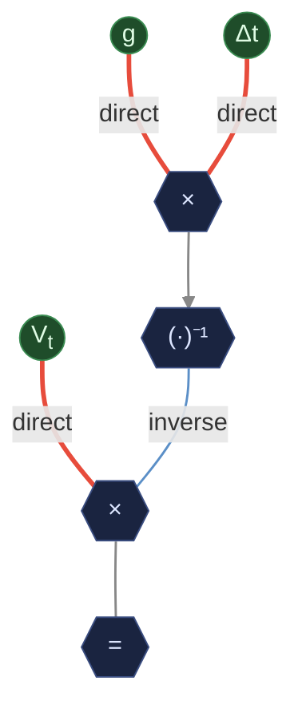

Note the arrow rule in action: edges into the symmetric `×` and `=` operators are plain lines; the only edge with an arrowhead is `mul2 → inv` because `(·)⁻¹` is a unary asymmetric operator (one input, transformed). The `direct` / `inverse` labels here are the edge `semantic` enum (driving the red/blue coloring), not operand role labels.

That's roughly the source: `Vₜ = (g · Δt)⁻¹` rewritten as `Vₜ × (g·Δt)⁻¹` (after the parser normalizes division to multiplication-by-inverse, per Category 3). Variables on the leaves, operators in the middle, edge color carries proportionality.

The style switches and per-category visual rules in the rest of this proposal **layer on top of** these existing conventions — they don't replace them. So when later sections talk about "swimlanes" or "edge labels" or "spatial bias," picture them inside this color/shape vocabulary, not on a fresh canvas.

---

## Category 1 — Symmetric relations (positional only)

`=`, `\neq`, `\approx`, `\equiv`, `\sim`, `\cong`, `\propto`

Operands are mathematically interchangeable. Roles are `lhs` / `rhs` but **don't paint labels by default** — the `=` glyph carries the meaning; spatial bias (LHS rendered left/above) conveys order.

**Example:** `\pi \approx 3.14`

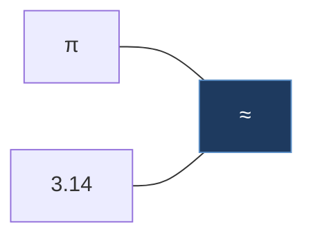

Plain (arrowless) lines — `≈` is symmetric, so there's nothing for the arrowhead to point at.

In `verbose` label mode, the same edges get small `lhs` / `rhs` annotations for accessibility — still arrowless:

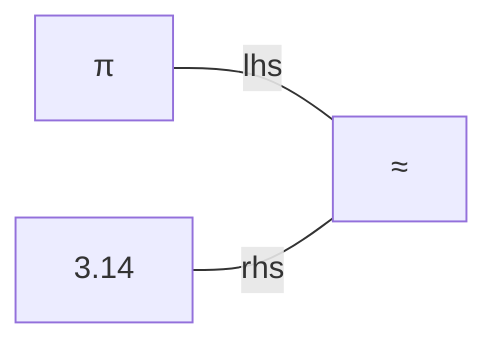

---

## Category 2 — Directional / semantic relations (show the role)

These carry **meaning** in the side: a premise is not interchangeable with a conclusion, a member is not interchangeable with the set it belongs to. Show role labels by default.

### 2a. Implication

**Source:** `x > 0 \implies x^2 > 0`

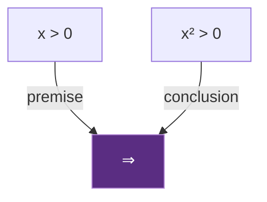

The reader instantly sees: hypothesis on the left, what follows on the right. No need to read the subtrees.

### 2b. Order relations

**Source:** `a \leq b`

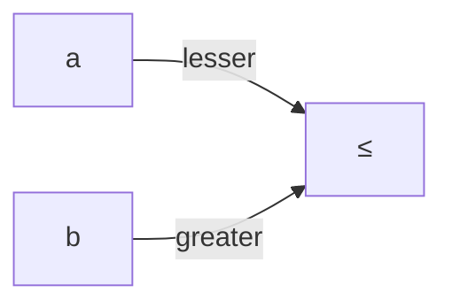

Symmetric in shape, but the roles disambiguate which side is the smaller value — useful when the LHS is itself a complex expression.

### 2c. Set-membership

**Source:** `x \in \mathbb{R}`

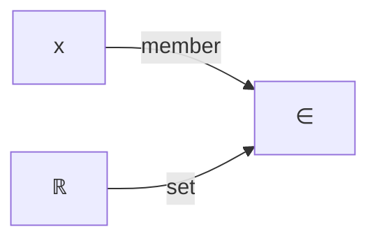

### 2d. Subset

**Source:** `A \subseteq B`

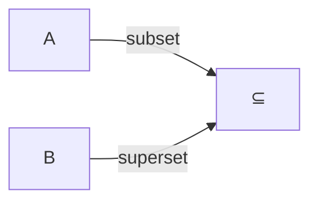

### 2e. Sequent / entailment

**Source:** `\Gamma \vdash \varphi`

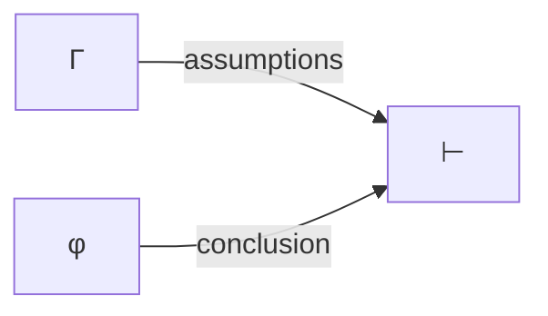

---

## Category 3 — Asymmetric operators (edge labels, no swimlane)

These have universal visual conventions, but readers still benefit from a small label on each edge — especially when the operands are complex enough that the geometric position alone gets lost.

The parser already normalizes **subtraction** to unary negation plus addition (`a - b` → `a + (-b)`) and **division** to multiplication by inverse (`a/b` → `a · b^{-1}`), so there's no `subtract` or `divide` node type to render. They reach the diagram through the existing `add`, `multiply`, `power`, and unary-`neg` machinery, and that decomposition is intuitive enough on its own — readers see the negative sign or the `^{-1}` and read `−` or `÷` mentally without help. So this category really only covers `^` and `_`.

### 3a. Power

**Source:** `x^n`

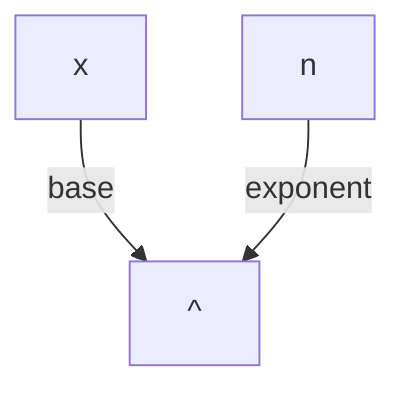

`base` and `exponent` labels mark the asymmetry. The geometric convention (base anchors, exponent floats) still applies, but the labels survive when the layout flips or when either operand is itself a non-trivial subtree.

### 3b. Subscript

**Source:** `x_i`

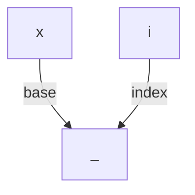

Same pattern as power — the role names (`base` / `index`) match what mathematicians actually call the operands, and they hold up when the index is a multi-character expression rather than a single letter.

---

## Category 4 — Function arguments (positional or function-specific)

Generic functions get positional `arg_n`. Recognized functions (`log`, `int`, `sum`, etc.) get **specific roles** the reader expects.

### 4a. Generic function

**Source:** `f(x, y, z)`

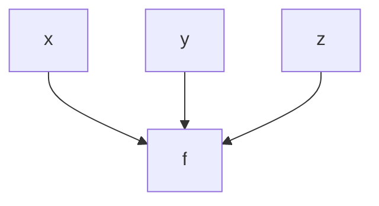

(Arrows kept — function arguments are positional, so `f(x, y) ≠ f(y, x)` in general; the function call is asymmetric in argument order.)

In `minimal` mode, no labels. In `verbose` mode, edges get `arg_1` / `arg_2` / `arg_3`.

### 4b. Logarithm

**Source:** `\log_b x`

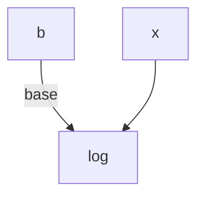

Base gets a label because it's positionally subscripted in LaTeX and could be missed; the main argument is unlabeled (it's the obvious one).

### 4c. Integral

**Source:** `\int_a^b f(x)\,dx`

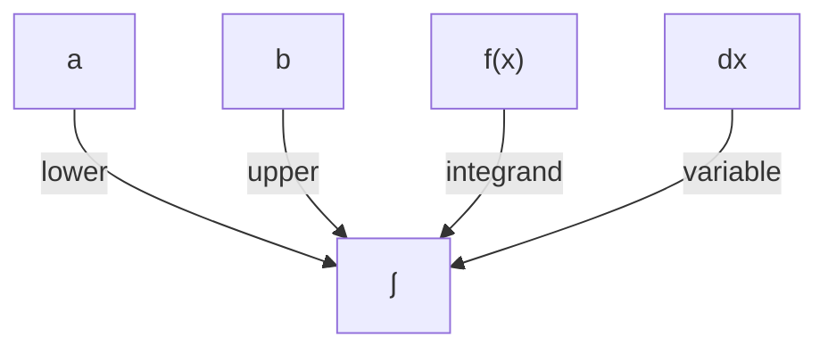

Integrals are notation-heavy and the four roles aren't visually distinguished by glyph alone — show all four labels. Same for `\sum`, `\prod`, `\lim`.

---

## Visual treatment by category

Two distinct strategies, applied per category, plus a third axis on edge style.

**Guiding principle 1 — swimlanes vs. edge labels:** swimlanes are for whole-statement operands; edge labels are for term operands. Wrapping a single symbol or small term in a labeled subgraph is overkill — a label on the edge does the same work without the visual weight.

**Guiding principle 2 — arrows are reserved for asymmetry.** Mermaid's default edge is an arrow (`-->`), but a graph full of arrows pointing every-which-way looks busy without communicating much, since *every* operand→operator edge is technically directional. Reserve arrowheads for edges where direction *means* something — i.e. into asymmetric / directional operators. Symmetric relations and operators (`=`, `≈`, `≡`, `+`, `·`, `\land`, `\lor`, top-level `,`) get **plain lines** (`---`), and the eye reads them as undirected partitions; asymmetric ones (`<`, `≤`, `^`, `_`, `∈`, `⊂`, `⇒`, `\int`, `\log`, …) get **arrows** (`-->`), and the arrowhead becomes the third independent direction signal alongside edge labels and (where applicable) swimlanes.

- **Symmetric relations on terms (`=`, `≈`, `≡`, `<`, `≤`, …):** *no swimlane, no edge labels*. **Spatial bias only** — LHS on the left, RHS on the right when layout is horizontal (LR / RL); LHS on top, RHS on bottom when vertical (TD / BT). The relation glyph sits dead center and does the separating work itself.
- **Directional relations on terms (`∈`, `⊂`, `⊆`, `\supset`, `\to` / `\mapsto`, integral / sum / product / limit operands):** *no swimlane*, but **mark each edge with the operand's role** (`member`, `set`, `from`, `to`, `lower`, `upper`, `integrand`, `variable`, `index`, …). One label per edge is enough — a labeled box per operand would crowd a small term.
- **Directional connectives whose operands are whole statements (`⇒`, `⇔`, `\vdash`, `\models`):** *swimlane each operand* in a role-titled subgraph (`premise` / `conclusion`, etc.) **and** mark the edges into the connective with the same role label, so the direction stays readable when swimlanes are turned off, or when two clusters end up far apart on the canvas.
- **Top-level comma-joined statements** (`a = 1, b = 2`, the multi-clause RHS of an implies): *swimlane each clause* — same rationale as #214. A box per statement, no inner role label since each clause is self-contained. **When the comma materializes as a synthetic node** (the conjunction node from #208 inside a relation operand), that node lives *outside* the clause subgraphs — sitting between them like the `=` glyph sits between its LHS and RHS. A relation node is never inside one of its own operands.
- **Asymmetric arithmetic operators (`^`, `_`):** *no swimlane*, but **mark each edge with the operand's role** (`base` / `exponent`, `base` / `index`). The geometric conventions are universal but fragile under layout changes or when either operand is a complex subtree — edge labels make the asymmetry survive. Subtraction and division never reach the renderer as their own operators — the parser normalizes them to addition-with-unary-neg and multiplication-by-inverse — so they inherit the symmetric `+` / `×` treatment plus a small `−` or `^{-1}` annotation.

### 1a (sym) — equality uses spatial bias and plain (arrowless) edges

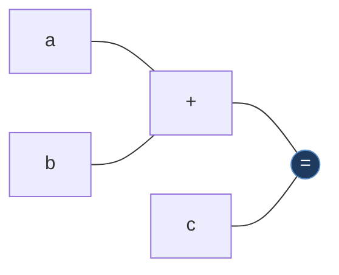

Source: `a + b = c`. The LHS subtree (`a + b`) flows in from the left; `c` comes from the right; `=` is the visual fulcrum between them. No labeled box needed — the glyph and the geometry already convey "left side equals right side." Plain lines (no arrowheads) reinforce the symmetry — there's no direction to point.

In a vertical layout, the same relation flips:

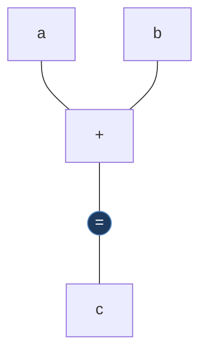

LHS above, RHS below — still arrowless, since `=` and `+` are both symmetric.

### 2a (dir) — implication uses swimlanes

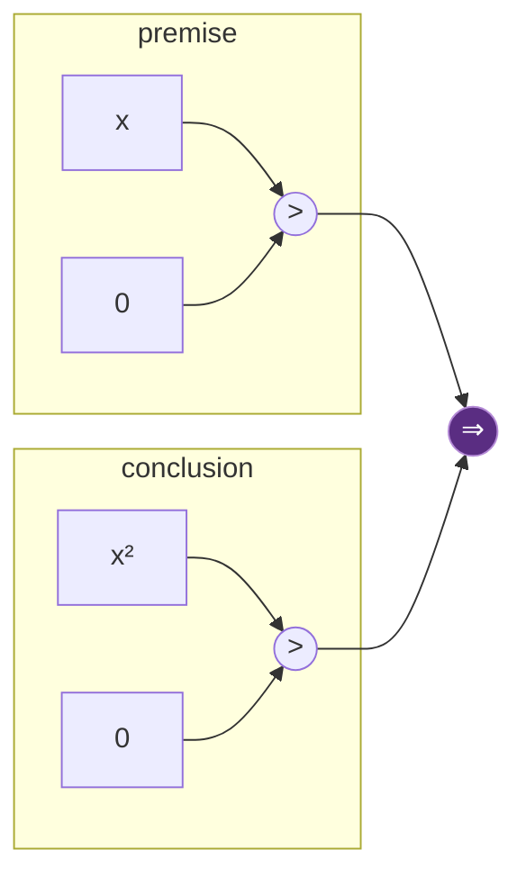

Source: `x > 0 \implies x^2 > 0`. The semantic role names *are* the swimlane titles. Premise on the left, conclusion on the right — no ambiguity.

### 2c (set) — set membership uses edge labels (no swimlane)

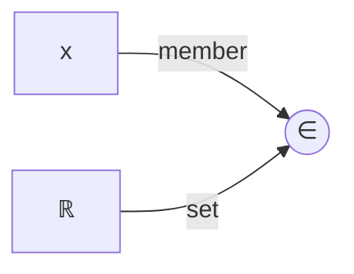

`∈` is asymmetric (a member belongs to a set, not vice versa), so the *direction* needs marking — but the operands are single terms, so a labeled box around each would be overkill. Edge labels carry the role efficiently.

Same shape for the other directional relations between terms:

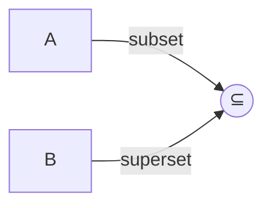

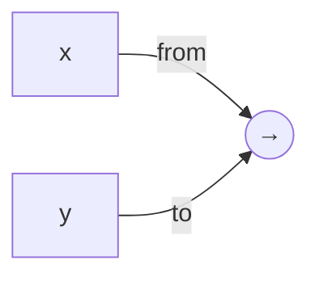

### 3a (asym) — power and subscript use edge labels, no swimlane

```mermaid
flowchart TD
  x["x"] -- "base" --> pow(("^"))
  n["n"] -- "exponent" --> pow
```

```mermaid
flowchart TD
  v["v"] -- "base" --> idx(("_"))
  i["i"] -- "index" --> idx
```

The asymmetry is universal but readers still benefit from `base` / `exponent` and `base` / `index` markers — especially when the base or exponent is itself a complex expression and the visual cue gets lost. Same reasoning as `\int` / `\sum`: a single label per edge stays readable; a labeled box per operand would be overkill on a two-arity operator. Subtraction and division aren't here because the parser already rewrites them as `a + (-b)` and `a · b^{-1}` — they ride the symmetric `+` / `×` machinery.

### 4c (function) — integral uses edge labels (no swimlane)

```mermaid
flowchart LR
  a["a"] -- "lower" --> int(("∫"))
  b["b"] -- "upper" --> int
  fx["f(x)"] -- "integrand" --> int
  dx["dx"] -- "variable" --> int
```

Four incoming edges *without* labels look like a hairball; **with** labels they read fine. The operands are single terms, so we don't need labeled boxes — the edge labels do the disambiguation. Same pattern applies to `\sum` (`index` / `lower` / `upper` / `summand`), `\prod`, and `\lim` (`index` / `target` / `expression`).

---

## How this stacks with #214 (top-level statement clusters)

[#214](https://github.com/ibenian/algebench/issues/214) wraps each top-level comma-joined statement (`a = 1, b = 2`) in its own outer cluster. With the rule above (no swimlane for symmetric relations, just spatial bias), the inner equalities stay clean:

```mermaid
flowchart TD
  subgraph S1["a = 1"]
    direction LR
    a1["a"] --- eq1(("="))
    one["1"] --- eq1
  end
  subgraph S2["b = 2"]
    direction LR
    b1["b"] --- eq2(("="))
    two["2"] --- eq2
  end
```

Outer cluster from #214 = "which statement"; inside each cluster the symmetric `=` uses spatial bias (LHS left, RHS right). No double-boxing.

When the inner relation **is** asymmetric (e.g. `a > 0, P(a) \implies Q(a)`), the inner relation gets its own swimlanes:

```mermaid
flowchart TD
  subgraph S["a > 0 ∧ P(a) ⇒ Q(a)"]
    direction LR
    subgraph PR["premise"]
      direction TB
      a1["a"] --> gt(("&gt;"))
      z["0"] --> gt
      pa["P(a)"]
      gt --- conj((","))
      pa --- conj
    end
    subgraph CO["conclusion"]
      qa["Q(a)"]
    end
    conj --> impl(("⇒"))
    qa --> impl
  end
```

Two layers of clustering, neither redundant: outer cluster says *which statement*, inner swimlanes say *which operand of the directional connective*.

---

## A worked example: the AlgeBench step from issue #208

**Source:** `r_α^2 + r_β^2 = 1 \implies r_α = \cos(θ/2),\ r_β = \sin(θ/2)`

After this proposal lands on top of the #208 fix:

```mermaid
flowchart LR
  subgraph PREM["premise"]
    direction LR
    sum["r_α² + r_β²"] --- eq0(("="))
    one["1"] --- eq0
  end
  subgraph C1["r_α = cos(θ/2)"]
    direction LR
    ra["r_α"] --- eq1(("="))
    cos["cos(θ/2)"] --- eq1
  end
  subgraph C2["r_β = sin(θ/2)"]
    direction LR
    rb["r_β"] --- eq2(("="))
    sin["sin(θ/2)"] --- eq2
  end
  eq1 --- conj((","))
  eq2 --- conj
  PREM == "premise" ==> impl(("⇒"))
  conj == "conclusion" ==> impl
  classDef dir fill:#5a2d82,stroke:#b48ad6,color:#fff
  class impl dir
```

The reader can scan, left to right: **premise** swimlane → ⇒ → conclusion side. The conclusion side is the comma node sitting *between* the two equality clusters (C1, C2) — relation glyphs are never inside their own operands. Each equality cluster (#214) uses pure spatial bias — LHS left, RHS right — no extra labeled boxes around each side.

The two thick edges entering ⇒ carry semantic role labels (`premise`, `conclusion`) — see *Marking direction on directional connectives* below for why.

---

## Marking direction on directional connectives

Symmetric `=` doesn't need edge labels (the glyph + spatial bias say it). But **directional** connectives (`⇒`, `⇔`, `→`, `↦`, `⊢`, `⊨`) carry meaning in *which direction the arrow points*, and that meaning gets lost if the renderer just draws two indistinguishable plain edges. Treat the two edges into a directional connective specially:

1. **Edge label** — show `premise` / `conclusion` (or `from` / `to`, etc.) directly on the edge, not just as a swimlane title. This survives even when swimlanes are turned off (`cluster.directional_operands=off`).
2. **Edge weight / style** — `premise → ⇒` gets a thicker stroke (the "supporting" edge); `conclusion → ⇒` gets a slightly different color (the "what follows" edge). Theme-defined.
3. **Arrowhead asymmetry** — Mermaid's `==>` (thick) for premise side, `-->` for conclusion side, makes the in/out semantics readable without the labels.

### Example: implication with marked direction (no swimlanes)

```mermaid
flowchart LR
  prem["x > 0"] == "premise" ==> impl(("⇒"))
  conc["x² > 0"] -- "conclusion" --> impl
  classDef dir fill:#5a2d82,stroke:#b48ad6,color:#fff
  class impl dir
```

Source: `x > 0 \implies x^2 > 0`. Even without swimlanes, you can see: thick edge from the premise, thin edge to the conclusion, role labels on both. This is how a `cluster.directional_operands=off, labels.role=always` theme would render.

### The same example with swimlanes (default)

```mermaid
flowchart LR
  subgraph PREM["premise"]
    direction TB
    x1["x"] --> gt(("&gt;"))
    z1["0"] --> gt
  end
  subgraph CONC["conclusion"]
    direction TB
    x2["x²"] --> gt2(("&gt;"))
    z2["0"] --> gt2
  end
  PREM == "premise" ==> impl(("⇒"))
  CONC -- "conclusion" --> impl
  classDef dir fill:#5a2d82,stroke:#b48ad6,color:#fff
  class impl dir
```

The labels and edge styles are *redundant* with the swimlane titles, but they remain useful when the diagram is large enough that the boxes are far apart. They also let the renderer drop the boxes (style switch) without losing the directional signal.

### Bidirectional `⇔` / `iff`

Both edges should be visually equivalent (no thick/thin asymmetry) — either drop the labels entirely or label both `lhs` / `rhs` to signal symmetry. The glyph itself (`⇔` with arrowheads on both ends) does most of the work.

---

## Putting all the rules together

---

## Display rules summary

| Category | Operators | Arrow on edges? | Edge label? | Swimlane? |
|---|---|---|---|---|
| Symmetric relations on terms | `=`, `≈`, `≡`, `\propto`, `\sim`, `\cong` | **No** (plain line) | Only in `verbose` | No |
| Symmetric arithmetic operators | `+`, `·`, `\land`, `\lor` | **No** (plain line) | No | No |
| Order relations | `<`, `\leq`, `>`, `\geq` | **Yes** | **Always** | No |
| Containment / membership | `\in`, `\subset`, `\subseteq`, `\supset` | **Yes** | **Always** | No |
| Maps-to / arrow on terms | `\to`, `\mapsto` (between symbols) | **Yes** | **Always** | No |
| Directional connectives on **statements** | `\implies`, `\iff`, `\Leftrightarrow`, `\vdash`, `\models` | **Yes** (thick on premise side) | **Always** | **Yes** (premise/conclusion swimlane) |
| Top-level statement separator | `,` (between formulas) | **No** (plain line) | No | **Yes** (one per clause, #214) |
| Asymmetric arithmetic operators | `^`, `_` (subtraction and division are normalized away by the parser) | **Yes** | **Always** (`base` / `exponent`, `base` / `index`) | No |
| Generic functions | `f(x, y, …)` | **Yes** | Only in `verbose` | No |
| Recognized functions | `\log`, `\int`, `\sum`, `\prod`, `\lim` | **Yes** | **Always** | No |

The `role` field stays in the data either way — it's used for ARIA/screen readers, agent queries, and tests.

---

## Style switches (everything above is configurable)

The visual treatment isn't one-size-fits-all — readers preparing for a proof exam want maximum scaffolding; advanced users want a clean diagram. Expose these as renderer flags / theme settings, all defaulting to the values shown:

| Setting | Default | Effect when enabled |
|---|---|---|
| `cluster.statements` | `on` | Wrap each top-level comma-joined statement in a Mermaid `subgraph` (#214) |
| `cluster.statement_connectives` | `on` | Wrap the premise/conclusion of `⇒` / `⇔` / `\vdash` / `\models` in a role-titled subgraph (only when the operand is itself a whole statement, not a single term) |
| `cluster.term_operands` | `off` | Force-wrap each operand of `∈` / `⊂` / `\int` / `\sum` / `\log` / … in a swimlane *even when the operand is a single term*. Off by default — edge labels are usually enough. |
| `cluster.symmetric_operands` | `off` | Wrap each side of `=` / `≈` / `<` / … in a swimlane (overrides the spatial-bias-only default) |
| `labels.role.term_relations` | `on` | Show `member` / `set` / `lower` / `upper` / `integrand` / … on edges into directional term relations |
| `labels.role.statement_connectives` | `on` | Show `premise` / `conclusion` on edges into `⇒`, `⇔`, etc. — even when the swimlane already says it (so direction stays readable when clusters are far apart, or when `cluster.statement_connectives` is off) |
| `labels.role.symmetric` | `off` | Show `lhs` / `rhs` on edges into `=` / `≈` / `<` (verbose mode) |
| `edges.directional_emphasis` | `on` | Use thick `==>` for the premise/from edge, thin `-->` for the conclusion/to edge — the third independent direction signal |
| `layout.symmetric.bias` | `lhs-first` | Walk LHS first so the layout engine puts it left/above; `rhs-first` flips. Other values: `none` (let Mermaid decide). |
| `cluster.title.style` | `role-name` | What text titles the cluster: `role-name` (`premise`, …), `subexpr` (the LaTeX of the operand), `none` (unlabeled box). |

Themes can ship with sensible presets:

- **`linalg-dark`, `power-flow-light`** (current defaults): everything at its default → clean, minimal scaffolding.
- **`tutorial-mode`** (new, for early-learner lessons): `cluster.term_operands=on`, `labels.role.symmetric=on`, `cluster.title.style=role-name` → maximum hand-holding.
- **`paper-figure`** (new, for static screenshots / publication): all `cluster.*` off, all `labels.role.*` off, `edges.directional_emphasis=off`, `layout.symmetric.bias=lhs-first` → pure topology, no decoration.

The Math dock can expose 2–3 of these as user-facing toggles in the controls bar (e.g. a "Show role labels" checkbox, a "Cluster statements" checkbox), keeping the rest theme-only.

---

## Open question: collapsible regions

The graph carries enough information to be **interactively foldable** at two granularities — and both are worth shipping together, because the underlying mechanism is the same.

**The interaction in one sentence:** click any operator node (or swimlane title) to fold its descendants into a single tile rendering its `subexpr` as KaTeX; click the tile to reveal the structure again. The fold/unfold chevron (`▾` for expanded, `▸` for collapsed) appears only on hover, in the node's top-right corner — keeping the diagram clean by default. Mermaid supports this natively via its `click` directive plus a re-render — no custom renderer needed (sketch below). A standalone HTML proof of concept exercising the full cycle was built and validated locally before this proposal landed.

### Two collapse targets

- **Clusters / swimlanes** (premise, conclusion, per-statement boxes). Folding a swimlane shows just the swimlane title and the role-labeled edges leaving it.
- **Operator nodes that have descendants and a `subexpr`.** Every operator in the parser's output already carries `subexpr` (the LaTeX slice of the subtree rooted at that node). That makes any internal operator a valid collapse target: click the `(·)⁻¹` node and its entire subtree (the `Δt`, `g`, the `×` joining them) folds into a single rendered tile showing `1 / (Δt·g)`. Click again to expand. Same for clicking an `=` to fold its LHS or RHS subtree, an `∧` to fold a conjunct, etc.

A node is collapsible iff:

1. It has at least one incoming edge (children — i.e. it's not a leaf variable/number), **and**
2. It carries a `subexpr` field (true for every operator/relation node in the current parser; not true for raw scalars/constants/text nodes).

The "parent" framing matters: a leaf `x` doesn't get a fold control because there's nothing under it to hide. The `=` at the top of a proof step does, because folding it shows the entire equation as a single rendered tile labeled with its LaTeX — which is what readers skimming a long proof actually want.

### Render: the collapsed-tile look

When a node folds, its descendant subgraph disappears and the node itself is replaced by a **rounded-rect tile** carrying the KaTeX-rendered `subexpr` — the same visual idiom as the existing tooltip/preview node in the `linalg-dark` reference (the `1/(Δt·g)` tile in the screenshot above). Clicking the tile re-expands. The hover-only chevron (`▸` on collapsed, `▾` on expanded) is the click affordance.

```mermaid
flowchart TD
  subgraph collapsed["1 / (Δt · g)"]
    tile["1 / (Δt · g)"]
  end
  Vt(("V<sub>t</sub>"))
  mul{{"×"}}
  eq{{"="}}
  Vt ---|direct| mul
  collapsed ---|inverse| mul
  mul --- eq
  classDef tile fill:#222a44,stroke:#5a6d8a,color:#dfe6ff
  class tile tile
```

The collapsed tile keeps its **outgoing** edges (to its parent operator) intact — that's what preserves the topology when a subtree is hidden. From the parent's perspective, nothing changed except that one operand became opaque.

### Implementation: yes, Mermaid is enough

Mermaid's [`click` directive](https://mermaid.js.org/syntax/flowchart.html#interaction) lets each node register a JavaScript callback. Combined with re-rendering on state change, that's all we need — no custom renderer, no DOM-tree surgery. Sketch:

```javascript
// Per node id, register a click callback in the emitted source:
//   click foo handleNodeClick
//   click bar handleNodeClick

window.handleNodeClick = (nodeId) => {
  const collapsed = state.graphPanel.collapsedIds;
  if (collapsed.has(nodeId)) collapsed.delete(nodeId);
  else                       collapsed.add(nodeId);
  rerenderGraph();   // rebuild Mermaid source from graph + collapsed set
};
```

The renderer (`graph_to_mermaid.py` + the Math dock JS that calls it) does the bookkeeping:

1. Walk the graph. For each collapsed node id, emit it as a single rounded-rect tile labeled with its `subexpr` (KaTeX-rendered) instead of its operator glyph.
2. Skip every node that's a descendant of any collapsed id — those are inside the folded region.
3. Skip every edge whose source *and* destination are both inside the same collapsed region — purely internal.
4. Emit a `click <id> handleNodeClick` line for every collapsible node (operator nodes with subexpr, plus cluster boundaries).

A condensed example of what the emitted source looks like for a partially-collapsed graph:

```mermaid
flowchart TD
  Vt(("V<sub>t</sub>"))
  mul{{"×"}}
  eq{{"="}}
  inv["1 / (Δt · g)"]
  Vt ---|direct| mul
  inv -. inverse .- mul
  mul --- eq
  click Vt handleNodeClick
  click mul handleNodeClick
  click inv handleNodeClick
  click eq handleNodeClick
  classDef tile fill:#222a44,stroke:#5a6d8a,color:#dfe6ff
  class inv tile
```

The `(·)⁻¹` subtree is folded into a tile labeled with its KaTeX `subexpr`. Click the tile → callback toggles the id out of `collapsedIds` → re-render → the `(·)⁻¹` operator and its `Δt`, `g`, `×` descendants come back.

### Why not other approaches

The earlier draft considered three approaches; with the click-directive route, only one is worth keeping:

- **Re-render on click (above)** — clean, idiomatic Mermaid, full layout reflow keeps the diagram readable. The cost is that nodes can shift position when something folds; in practice this is acceptable because the user just took an action and expects the diagram to update.
- *Rejected: post-render SVG manipulation* — would need to hide `<g>` elements and overlay a tile at the collapsed node's coordinates. Avoids reflow but leaves gaps, and breaks if Mermaid changes its SVG structure.
- *Rejected: server-side virtualization* — emit a different graph from the backend depending on `collapsedIds`. Slowest round-trip, no benefit over client-side re-render.

The recommendation is just: re-render on click, using Mermaid's own `click` directive. No custom renderer needed.

### UI affordance

A small chevron in the top-right corner of every collapsible node is enough — same affordance for clusters and operator nodes, so users learn it once. **Show it only on hover**, not by default: the diagram stays clean while reading; the affordance reveals itself when the user starts looking for one. Use `▾` (down) for currently-expanded nodes ("click to fold the contents below") and `▸` (right) for collapsed tiles ("click to reveal what's hidden").

Implementation note: in the PoC, the chevron is injected as an SVG `<text class="chevron">` child of each foldable `<g class="node">`, with `mouseenter` / `mouseleave` listeners directly toggling its opacity. CSS `:hover` selectors proved unreliable through Mermaid's nested SVG structure.

State should persist per proof step (so navigating away and back doesn't unfold what the user collapsed), but reset when the user changes scenes — readers shouldn't carry collapse state into a fresh derivation.

This is genuinely a follow-up to the core proposal — none of it is required for the swimlane/edge-label/spatial-bias work to land — but the proposal lays the foundation by making sure every collapsible node already has a meaningful `subexpr` and a clear cluster role.

---

## Cost

- **Parser:** add `role` to edges in `_walk` family + `_split_on_relation` handler. ~50 lines, mechanical.
- **Renderer:** gate label emission on `role` + `label_mode`. ~30 lines + role-name table.
- **Theme:** optional — themes can opt into role-based styling.
- **Tests:** per-operator coverage of role assignment.

One issue, one PR. No coordination overhead with #214 (subgraph clusters) — they're orthogonal.

---

## Notes on related conventions

The visual primitives here — labeled edges, role-titled clusters, asymmetric edge styling, geometric conventions for power and fraction — all have analogues in adjacent fields. The proposal isn't trying to invent any of them; it's picking a consistent combination tuned for AlgeBench's content. One alternative worth keeping in mind for a future theme: rendering implication as a horizontal rule with the premise stacked above and conclusion below, instead of the role-titled subgraph — a more compact layout for inference-heavy content, suitable as an opt-in `proof-mode` preset rather than the default.

---

## Bonus: why this matters beyond aesthetics

- **Semantic graph queries:** "highlight every premise on this proof page" becomes a single edge filter.
- **Accessibility:** screen readers can announce *"premise: x greater than zero, conclusion: x squared greater than zero"* instead of reading raw glyph names.
- **Theme-driven emphasis:** a "proof flow" theme could draw `premise → conclusion` thick/red while `subset → superset` stays neutral.
- **Progressive disclosure:** `minimal` mode relies on glyphs and geometry; `verbose` mode shows full role labels. Same data, two reading levels.
