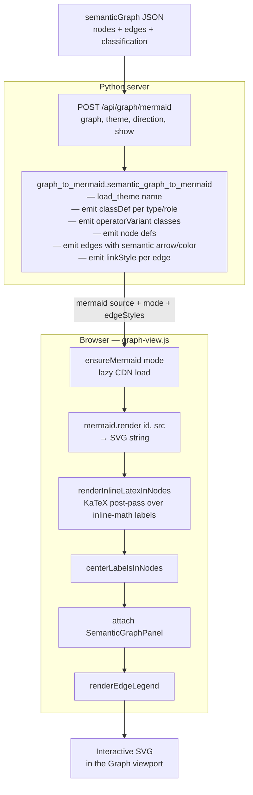

# Semantic Graph Visualization — Architecture

## Overview

This document describes how a **semantic graph** (JSON produced by the
LaTeX parser — see [latex-parser-design.md](latex-parser-design.md)) is
rendered into an interactive, themeable flowchart inside the AlgeBench UI.

Responsibility split:

| Layer | Lives in | Responsibility |
|---|---|---|
| **Graph builder** | `scripts/latex_to_graph.py` | LaTeX → semantic graph JSON (covered in the parser design doc) |
| **Mermaid emitter** | `scripts/graph_to_mermaid.py` | Semantic graph JSON + theme → Mermaid source |
| **HTTP API** | `server.py` (`/api/graph/*`) | Theme listing, LaTeX-to-graph helper, Mermaid regeneration |
| **Frontend panel** | `static/graph-view.js`, `static/graph-panel/*` | Dock tab, Mermaid runtime, KaTeX post-pass, node info panel |
| **Themes** | `themes/semantic-graph/*.json` + `schemas/semantic-graph-theme.schema.json` | Per-node/per-edge visual presets |

The pipeline is deliberately **server-authoritative for layout, client-side
for presentation polish**. The server emits Mermaid source; the client runs
Mermaid to produce SVG and then rewrites node labels with KaTeX for
TeX-quality typography.

## Pipeline

Any of theme, direction, or label preset changing refires this pipeline
from the API call onward — the semantic graph itself is never re-parsed.

## Backend

### `scripts/graph_to_mermaid.py`

Pure function boundary: `semantic_graph_to_mermaid(graph, theme, show) → str`.
No I/O besides theme loading. Reused by the CLI (`./run.sh scripts/graph_to_mermaid.py ...`)
and by the HTTP API.

Key responsibilities:

- **Shape resolution** — three-level fallback: op-specific shape
  (e.g. `negate` → `inv_triangle`) → theme's `nodeStyles.<type>.shape` →
  `rect`. The graph schema is semantic-only; shape never leaks into the
  graph JSON.
- **Class emission** — each referenced node type / role / variant becomes
  one `classDef`. Mermaid 11's typed-shape form (`nid@{ shape: "tri", ... }`)
  doesn't accept the `:::className` shortcut, so typed shapes get a separate
  `class nid className` statement.
- **Edge styling** — per-semantic `stroke` / `strokeWidth` / `arrow` pulled
  from `theme.edgeStyles[semantic]`, emitted as one `linkStyle i ...` line
  per edge.
- **Edge width scaling** — `_resolve_edge_width` multiplies the semantic's
  base stroke by `edge.weight` and clamps to `[1px, 8px]`. Without the
  ceiling an `x^100` edge would be a 400 px slab; without the floor a
  zero-weight edge would be invisible.
- **Semantic auto-inference** — untagged edges get a best-guess `semantic`
  based on the topology (out of a `power` node with literal exponent: sign
  and magnitude decide `direct` / `inverse` and weight; into a `multiply`:
  `direct` with unit weight). Explicit edge tags always win.
- **Logical-connective override** — edges whose destination `op` is
  `implies` / `iff` render with the theme's pseudo-semantic `logical`
  entry (dotted arrow by convention). Lets the reader distinguish "LHS
  implies RHS" from "operand flows into operator" at a glance.

### HTTP API (`server.py`)

| Endpoint | Purpose |
|---|---|
| `GET /api/graph/themes` | List `{name, mode}` for every theme in `themes/semantic-graph/`. Powers the theme dropdown grouped by light/dark. |
| `POST /api/graph/from-latex` | `{latex, domain?}` → semantic graph JSON. Thin wrapper around `_derive_semantic_graph` — same dot-derivative rewrites, accent peeling, and multichar-subscript handling as the scene-load path. |
| `POST /api/graph/mermaid` | `{graph, theme, direction, show}` → `{mermaid, mode, edgeStyles, ...}`. Idempotent — called on every theme/direction/label change. |

The Mermaid endpoint also returns `edgeStyles` verbatim so the client can
paint a legend whose colors/widths match the theme without re-reading the
theme file.

**Module reloading**: scripts are loaded via `_load_script_module` with
mtime-based cache invalidation (`server.py:84-110`). Editing
`scripts/graph_to_mermaid.py` or a theme JSON shows up in the next
request without restarting uvicorn.

## Theme system

### Schema — `schemas/semantic-graph-theme.schema.json`

Every theme JSON is validated against this schema in CI (`validate-data.yml`).
Top-level fields:

- `name` (kebab-case, must match filename stem)
- `mode` (`light` | `dark`) — drives the picker grouping and Mermaid's base
  theme init
- `direction` (`LR` | `RL` | `TB` | `BT`) — Mermaid flowchart direction
- `labelMode` (`emoji` | `latex` | `plain`) — how symbol labels are composed
- `nodeStyles` — per node type: shape + fill/stroke/color
- `operatorVariants` — per-variant (`direct` / `inverse` / `neutral`) color
  overrides for operator/function/expression nodes; shape comes from
  `nodeStyles.operator`
- `edgeStyles` — per edge semantic (`direct` / `inverse` / `neutral` /
  `logical`): stroke color, width, arrow kind
- `paintBySemantic` — when true, every edge is painted from `edgeStyles`;
  when false, one flowchart-wide `linkStyle default` is emitted
- `fontSize` — default label size in pixels (overridable per `nodeStyle`)

The `logical` key under `edgeStyles` is a *pseudo-semantic* — no edge in
the graph JSON carries `semantic: "logical"`. The emitter applies it when
the destination node is a logical connective, as a last-mile override of
whatever semantic the edge actually had.

### Theme catalog

Twelve themes ship in `themes/semantic-graph/`, organized in light/dark
pairs:

| Family | Light | Dark | Notes |
|---|---|---|---|
| `default` | ✓ | ✓ | Neutral baseline — safe starting point |
| `minimal` | — | ✓ | Line-only, for dense diagrams |
| `minimal-flat` | ✓ | ✓ | Flat fills, no stroke emphasis |
| `role-colored` | ✓ | ✓ | Paints by semantic role (state/parameter/coefficient/…) |
| `power-flow` | ✓ | ✓ | Edge color/width carries proportionality strength |
| `power-direction` | ✓ | ✓ | Edge *arrow kind* (solid/thick/dotted) carries direction |
| `linalg` | — | ✓ | Tuned for vector/matrix expressions |

Users select via the Math dock dropdown; choice persists via
`localStorage` key `algebench.graph.theme`.

## Frontend

### `static/graph-view.js`

Owns the Graph tab lifecycle. Key behaviors:

- **Lazy Mermaid load** — `index.html` does *not* include `mermaid.min.js`.
  The ~700 KB bundle is fetched from jsDelivr on first activation of the
  Math tab via `loadMermaidLib()`. The load promise is memoized; on
  failure it's cleared so a later tab activation can retry.
- **Mode-aware init** — `initMermaidForMode('dark'|'light')` reinitializes
  Mermaid with matching theme variables whenever the selected theme's
  `mode` differs from the currently active one.
- **`securityLevel: 'loose'`** — required for `htmlLabels: true` and the
  KaTeX post-pass that rewrites node label contents. Graphs are
  server-derived from trusted scenes, not user input.
- **Direction translation** — our UI vocabulary (`left-right`,
  `top-down`, …) is reader-perspective; our graphs point
  variables → operators → root, which is the *opposite* direction from
  what reads as "left to right" on screen. The `DIRECTION_TO_MERMAID`
  table applies the flip at the API boundary (`left-right → RL`,
  `top-down → BT`). `LEGACY_DIRECTION_MAP` one-shot-migrates old
  localStorage values.
- **Cache key** — `stableStepKey(step) | theme | direction | labels`.
  Identical keys skip the re-render; `force = true` bypasses the cache
  (used after theme-dropdown change).
- **Zoom** — display-percent space where 100% = 0.7× raw Mermaid SVG
  (raw output is too large for the card). Clamped `[40%, 400%]`.
  Persists in localStorage.

### KaTeX post-pass — `renderInlineLatexInNodes`

Mermaid's own KaTeX integration only fires on display-math (`$$..$$`) and
emits MathML-only. The browser's native math renderer has tight accent
placement (the hat in `\hat{H}` sits on top of the H), no stretchy
primes, and it swallows the surrounding ` ` separators we use for
multi-line labels.

We work around it by emitting **inline `$..$`** for every operator /
function / expression label, then walking the rendered foreignObject
text nodes and running KaTeX's HTML output pass over each match. That
gets us TeX-quality typography and preserves line breaks.

Trade-off: Mermaid sized each node box from the raw LaTeX string
(`$\hat{H}$` measures much wider than the rendered `Ĥ`). We run
`centerLabelsInNodes` afterward to flex-center the KaTeX content inside
the oversized shape — edges stay attached, label visually sits in the
middle.

### Highlight overlay

When a proof step's math contains `\htmlClass{hl-X}{expr}`, the server
(`_extract_htmlclass_pairs` + `_apply_highlights_to_graph` in `server.py`)
walks the derived graph and annotates matching nodes with three fields
from the step's `highlights` dict:

- `color` — painted by the renderer as an inline stroke override
- `description` — surfaced as the node label (if the current preset
  includes it)
- `highlight` — the original class key (e.g. `"m"` for `hl-m`), kept
  informational for future cross-reference visualizations

The two-pass matcher runs leaf symbols first, then operators, so
`\htmlClass{hl-mdot}{\dot{m}}` matches the `m` variable node (after the
dot-derivative rewrite) rather than a transient operator.

### `SemanticGraphPanel` (`static/graph-panel/`)

Attached to the rendered SVG. Listens for click events on nodes and
populates the inline info panel below the graph with the node's full
metadata (role, unit, quantity, dimension, description, LaTeX preview).
Cleaned up via `destroy()` on every re-render to avoid stale listeners.

## Key design decisions

**Server regenerates Mermaid on every theme/direction change.**
Alternative: keep the graph JSON on the client and regenerate in JS.
Rejected because (a) `graph_to_mermaid.py` already exists as the
authoritative emitter for CLI users and CI snapshot tests, (b) keeping
theme logic on the server means theme authors need only touch JSON, not
JS.

**Mermaid rather than D3 / custom SVG.**
Flowchart layout is the interesting hard problem; we offload it entirely.
The cost is ~700 KB of bundle (paid lazily, once per session) and living
with Mermaid's styling quirks (typed shapes needing separate `class`
statements, `securityLevel: 'loose'` for htmlLabels). Net: writing a
layout engine would dwarf the entire rest of this subsystem.

**Inline `$..$` for labels, not `$$..$$`.**
See the KaTeX post-pass section — Mermaid's built-in KaTeX path is
MathML-only, which loses typographic quality and eats ` `
separators.

**Edge width scaled by `weight`, clamped `[1, 8]`.**
Exponents and coefficients can be arbitrarily large; a naïve
multiplication would produce visual explosions. The ceiling lets `x²`
feel noticeably stronger than `x` without letting `x^100` dominate the
canvas.

**Auto-inference of `semantic` for untagged edges.**
Hand-authored demo scenes shouldn't need to tag every edge. The
inference rules (power exponent sign/magnitude, multiply factor,
logical-connective override) are chosen so the common case "just works"
while explicit tags always win.

**Direction vocabulary flipped from Mermaid's token.**
Reader-perspective names are more discoverable in the dropdown ("I want
the root on the left") than Mermaid's edge-flow tokens ("RL because my
edges point from children to parent"). The translation is a single
four-entry table.

## Extension points

**Adding a theme** — drop `themes/semantic-graph/<name>-<mode>.json`,
conform to the schema. Appears in the dropdown automatically via
`/api/graph/themes`. CI catches schema mistakes.

**Adding a node type** — declare it in
`schemas/semantic-graph.schema.json` (`nodeType` enum), then optionally
add a `nodeStyles.<type>` entry in the themes that should style it
explicitly. Falls back to `rect` when unstyled.

**Adding an edge semantic** — reserve the key in both
`schemas/semantic-graph.schema.json` (edge's `semantic` field) and
`schemas/semantic-graph-theme.schema.json` (`edgeStyles` properties).
Emitter picks it up automatically if `paintBySemantic: true`.

**Adding a new label preset** — extend `LABEL_PRESETS` in
`graph-view.js` with a field-list keyed by the dropdown value. The
server's `show` parameter takes the list verbatim.

## Known limitations

- **Mermaid is required at render time** — no offline fallback. If the
  CDN fetch fails the panel shows an error. Acceptable because the tool
  is local-dev first; a future self-host of the bundle is straightforward.
- **Random SVG ids** — `gp-svg-${rand6}` could theoretically collide on
  rapid re-renders. Monotonic counter would be more defensive.
- **`stripLatex` best-effort** — the tree-label `\htmlClass` stripper
  uses a shallow regex; nested braces in the class body aren't handled.
  Fine for display labels.
- **`/objects/` path handler** uses the older string-strip pattern for
  containment — tracked in [#130](https://github.com/ibenian/algebench/issues/130).
