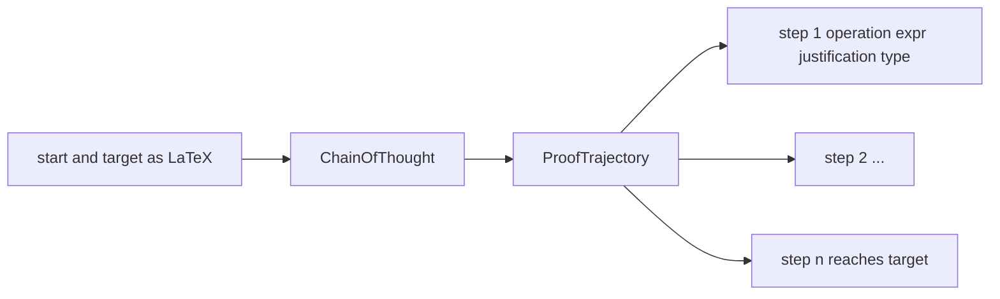
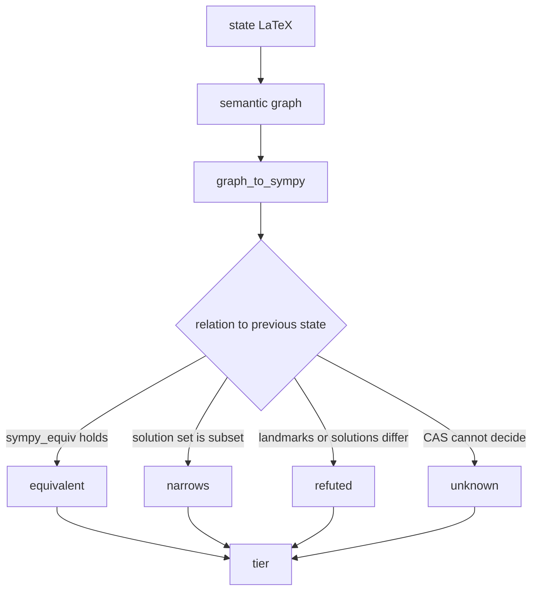
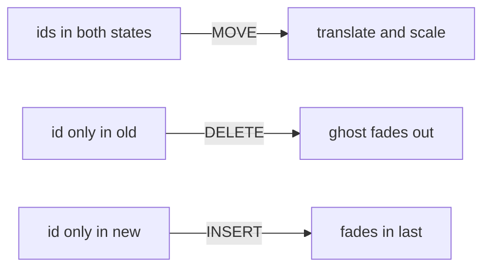
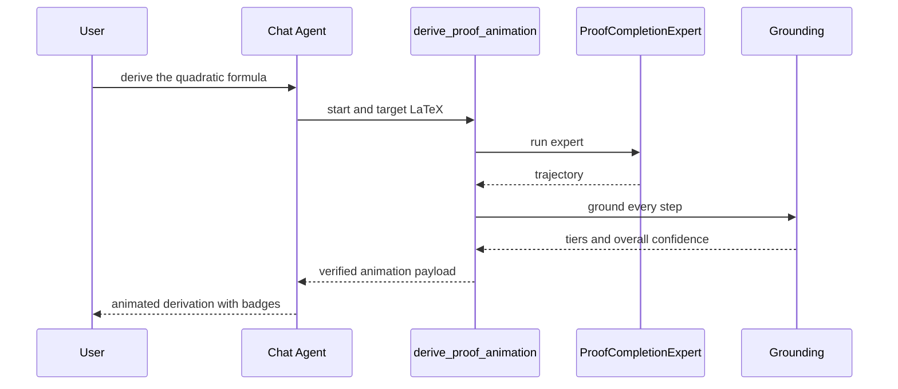
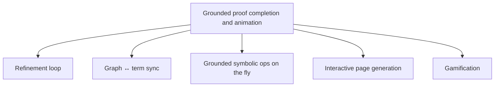

# Grounded Proof Completion & Animation — a Show & Tell

AlgeBench can take a *starting* expression and a *target* expression, ask an LLM
to write the step‑by‑step derivation between them, **verify every step with a
computer‑algebra system**, rank how confident we are in each step, and then
**animate** the whole thing as a smooth, morphing transformation on the semantic
graph — with a confidence badge on each step that never overclaims.

This post is the 10,000‑ft tour. Each numbered section below is really its own
deep‑dive — **I'll expand each into a standalone post** later.

> _[screenshot placeholder: the proof animation mid‑morph with a GROUNDED badge]_

---

## The big picture

<svg viewBox="0 0 920 430" xmlns="http://www.w3.org/2000/svg" font-family="system-ui, sans-serif">
  <defs>
    <marker id="arr" markerWidth="10" markerHeight="10" refX="8" refY="3" orient="auto">
      <path d="M0,0 L8,3 L0,6 Z" fill="#7c83ff"/>
    </marker>
    
  </defs>

  <!-- inputs -->
  <rect class="box io" x="20" y="180" width="150" height="68"/>
  <text class="lbl" x="95" y="208" text-anchor="middle">User / Agent</text>
  <text class="sub" x="95" y="226" text-anchor="middle">start → target</text>

  <!-- proof completion -->
  <rect class="box llm" x="210" y="170" width="180" height="90"/>
  <text class="lbl" x="300" y="200" text-anchor="middle">Proof Completion</text>
  <text class="sub" x="300" y="218" text-anchor="middle">DSPy ChainOfThought</text>
  <text class="sub" x="300" y="234" text-anchor="middle">emits a trajectory</text>

  <!-- grounding -->
  <rect class="box cas" x="430" y="60" width="200" height="110"/>
  <text class="lbl" x="530" y="90" text-anchor="middle">Grounding</text>
  <text class="sub" x="530" y="110" text-anchor="middle">LaTeX → semantic graph</text>
  <text class="sub" x="530" y="126" text-anchor="middle">graph → SymPy</text>
  <text class="sub" x="530" y="142" text-anchor="middle">step‑to‑step checks</text>
  <text class="sub" x="530" y="158" text-anchor="middle">→ 5 confidence tiers</text>

  <!-- animation -->
  <rect class="box anim" x="430" y="250" width="200" height="110"/>
  <text class="lbl" x="530" y="280" text-anchor="middle">Animation builder</text>
  <text class="sub" x="530" y="300" text-anchor="middle">rebase → stable ids</text>
  <text class="sub" x="530" y="316" text-anchor="middle">annotated LaTeX</text>
  <text class="sub" x="530" y="332" text-anchor="middle">attach confidence</text>

  <!-- frontend -->
  <rect class="box io" x="690" y="170" width="200" height="120"/>
  <text class="lbl" x="790" y="200" text-anchor="middle">Frontend</text>
  <text class="sub" x="790" y="222" text-anchor="middle">FLIP morph on data‑n</text>
  <text class="sub" x="790" y="240" text-anchor="middle">per‑step badges</text>
  <text class="sub" x="790" y="258" text-anchor="middle">overall confidence pill</text>

  <!-- edges -->
  <path class="edge" d="M170,214 L205,214"/>
  <path class="edge" d="M392,196 C415,160 415,150 428,125"/>
  <path class="edge" d="M392,235 C415,270 415,280 428,300"/>
  <path class="edge" d="M632,120 C665,150 670,165 700,200"/>
  <path class="edge" d="M632,300 C665,270 670,255 700,225"/>
</svg>

**One sentence:** an LLM writes the math, a CAS judges it, and a deterministic
renderer animates it — confidence flows all the way to a badge the user sees.

---

## 1. How proof completion works  ·  _(its own post)_

The model never touches graphs. It's given the **start** and **target** as
LaTeX and asked to emit a single *trajectory* of steps. Each step is one
mathematical move plus the **complete expression** you reach after it:

| field | example |
|---|---|
| `operation` | "add $\frac{c}{a}$ to both sides" |
| `expr_latex` | `x^2 + \frac{b}{a}x = -\frac{c}{a}` |
| `justification` | "addition property of equality" |
| `change_type` | `rewrite` · `solve` · `substitute` · `approximate` · `given` |

It's a thin DSPy module — `dspy.ChainOfThought(ProofCompletionSig)` — so the
*prompt itself is optimizable* (MIPROv2/GEPA), and the expert binds the
start/target LaTeX from the context graphs before inference.

The crucial design choice: **the model emits full expressions, not graph
edits.** That keeps it doing what LLMs are good at (math in LaTeX) while the code
side owns everything structural.

> _[screenshot placeholder: the derive CLI output — steps with per‑step glyphs]_

---

## 2. How grounding works — semantic graph + SymPy  ·  _(its own post)_

This is the heart of "grounded." Every state the model wrote is turned into a
**semantic graph**, the graph is reconstructed into a **SymPy** expression, and
each *transition* `state[k‑1] → state[k]` is classified by what SymPy can prove.

The checks run cheapest‑first and stop at the first that decides: symbolic
equivalence → exact solution‑set containment → squared/branch pair for roots →
scaled residual for multiply/divide both sides → parametric narrowing for
multivariate → a **characteristic fingerprint** (real roots, singularities,
limits — landmarks, *not* random sampling) → numeric tolerance for declared
approximations. Each consecutive pair collapses to one of **five tiers**:

| Tier | Icon | Meaning |
|---|---|---|
| **Grounded** | 🥇 | symbolically proven to follow from the previous step |
| **Verified** | 🥈 | strong CAS evidence, short of a full symbolic proof |
| **Plausible** | 🔹 | valid math, but the CAS couldn't decide this step |
| **Unchecked** | ○ | not a single convertible expression (e.g. `\pm`, `\dots`) |
| **Refuted** | ✗ | the CAS shows it does **not** follow |

The overall verdict is the **weakest link** plus an endpoint gate (did the chain
actually reach the target?). And the model's `change_type` is only an *advisory
claim* — **SymPy is the judge**; a mislabeled step is downgraded one tier.

> Worth underlining: a wrong middle step like `x^2 = 4 → x = 7` used to slip
> through (it parses fine). Now it's **Refuted** — SymPy sees `7` isn't a root.

> _[screenshot placeholder: a derivation with a mix of Grounded/Verified/Plausible badges + the tinted step strip]_

---

## 3. How the animation stays stable — rebasing for stable ids  ·  _(its own post)_

A smooth morph needs to know *which glyph is which* across two states — the
`2` in `c^2` must keep its identity so it glides instead of vanishing and
reappearing. We get that by **rebasing** every state's graph onto the previous
one and threading a stable node id through.

<svg viewBox="0 0 900 250" xmlns="http://www.w3.org/2000/svg" font-family="system-ui, sans-serif">
  <defs>
    <marker id="arr2" markerWidth="10" markerHeight="10" refX="8" refY="3" orient="auto">
      <path d="M0,0 L8,3 L0,6 Z" fill="#d4a017"/>
    </marker>
    
  </defs>
  <text class="t" x="120" y="30" text-anchor="middle">state k‑1</text>
  <rect class="n" x="60" y="50" width="120" height="36" rx="8"/>
  <text class="t" x="120" y="73" text-anchor="middle">x · (x+1)</text>
  <rect class="n" x="40" y="110" width="60" height="32" rx="8"/><text class="c" x="70" y="131" text-anchor="middle">id=a · x</text>
  <rect class="n" x="120" y="110" width="80" height="32" rx="8"/><text class="c" x="160" y="131" text-anchor="middle">id=b · (x+1)</text>

  <text class="t" x="640" y="30" text-anchor="middle">state k (rebased)</text>
  <rect class="nn" x="560" y="50" width="160" height="36" rx="8"/>
  <text class="t" x="640" y="73" text-anchor="middle">x·x + x·1</text>
  <rect class="n" x="520" y="110" width="60" height="32" rx="8"/><text class="c" x="550" y="131" text-anchor="middle">id=a (kept)</text>
  <rect class="n" x="600" y="110" width="60" height="32" rx="8"/><text class="c" x="630" y="131" text-anchor="middle">id=b (kept)</text>
  <rect class="nn" x="680" y="110" width="70" height="32" rx="8"/><text class="c" x="715" y="131" text-anchor="middle">new id</text>

  <path class="keep" d="M105,126 C300,200 360,200 540,126"/>
  <path class="keep" d="M195,126 C360,210 420,210 610,126"/>
  <text class="c" x="430" y="225" text-anchor="middle">persisting sub‑expressions keep their id → they MOVE, not delete+insert</text>
</svg>

The rebase is GumTree‑style: anchor the **largest identical subtrees first** (by
a downward subtree signature), recursively align their descendants, then a
content‑only fallback for what changed; genuinely new nodes get a fresh id.
Render with `to_latex(..., with_ids=True)` and every glyph carries
`\htmlData{n=<id>}`. The browser engine then runs a **FLIP** animation keyed on
`data-n`:

So everything that persists interpolates; only genuinely new pieces fade in and
removed pieces fade out. That's the whole trick behind the Manim‑style morph.

> _[screenshot placeholder: two consecutive states side by side showing the same glyph ids]_

---

## 4. The agent tool that triggers a derivation  ·  _(its own post)_

The chat agent can produce a derivation on demand. The user asks in natural
language; the agent infers the endpoints and calls a tool that returns a
**verified** animation, identical to clicking a node's "Derive" button.

Because the payload carries the confidence tiers, the agent **can't present
hand‑waving as proof** — an ungrounded step shows up honestly as Unchecked or
Refuted rather than a confident‑looking wrong answer.

> _[screenshot placeholder: chat asking for a derivation, animation appearing in the panel]_

---

## Where this is going — upcoming improvements

Each of these is a post in its own right too; here's the teaser.

- **Refinement.** Today we *rank* confidence; next we *raise* it. A retry loop
  scores each draft with a blended signal — well‑formedness + tier‑graded
  grounding + a soft LLM‑judge for clarity/pedagogy — and regenerates against a
  single threshold, feeding the specific failure back to the model. Hard gates
  set the floor, the judge shapes the gradient.

- **Graph ↔ term sync.** Bidirectional, loop‑safe binding so editing the term
  updates the semantic graph and vice‑versa — the graph and the algebra stay one
  object, not two views that can drift.

- **Grounded symbolic operations on the fly.** A conversational CAS: the user
  *talks* to do math — "simplify this", "multiply both sides by $a$",
  "substitute $u = x+1$" — and each operation is applied **and grounded** on the
  live expression. A symbolic‑math bot where every move is CAS‑verified, not
  guessed.

- **Interactive page generation.** The user plays with equations and proofs,
  then drops any of them into a beautifully rendered page alongside other content
  (charts, text), and saves it. Sharing with others follows — gated on auth and
  share mechanisms.

- **Gamification.** The AI rolls out little games to make the learner an active
  participant — "what's the next step?", multiple‑choice moves, predict‑before‑
  reveal — instead of passively watching the animation.

---

### TL;DR

An LLM proposes the math, a semantic‑graph + SymPy pipeline **grounds** every
step into one of five honest confidence tiers, and a deterministic rebasing
renderer **animates** the whole derivation with stable ids and per‑step badges —
all triggerable straight from chat. Ranking confidence was step one; **raising**
it (refinement), talking math into existence (conversational CAS), and turning it
into shareable, playable pages are what's next.

> _[screenshot placeholder: hero shot of a fully Grounded derivation, overall pill expanded]_
